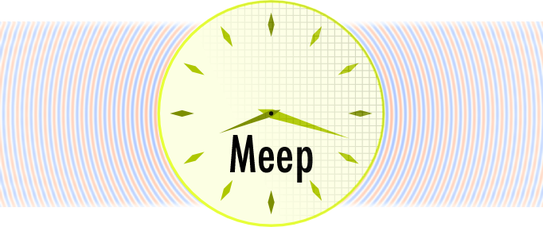

> **Note:** This is a fork of the original [NanoComp/meep](https://github.com/NanoComp/meep) repository. This fork enhances the original project with comprehensive documentation including a detailed [Architecture Guide](docs/ARCHITECTURE.md), a step-by-step [Developer Guide](docs/DEVELOPER_GUIDE.md), and an extensive [User Guide](docs/USER_GUIDE.md) with 10 educational use cases and Windows installation instructions. All original source code remains unchanged.

[](https://github.com/NanoComp/meep/actions/workflows/build-ci.yml)
[](https://github.com/NanoComp/meep/actions/workflows/build-san.yml)
[](http://meep.readthedocs.io/en/latest/)

[](https://codecov.io/gh/NanoComp/meep)

**Meep** is a free and open-source software package for [electromagnetics](https://en.wikipedia.org/wiki/Electromagnetism) simulation via the [finite-difference time-domain](https://en.wikipedia.org/wiki/Finite-difference_time-domain_method) (FDTD) method spanning a broad range of applications.

## Key Features

-   **Free and open-source software** under the [GNU GPL](https://en.wikipedia.org/wiki/GNU_General_Public_License).
-   Complete **scriptability** via [Python](https://meep.readthedocs.io/en/latest/Python_Tutorials/Basics/), [Scheme](https://meep.readthedocs.io/en/latest/Scheme_Tutorials/Basics), or [C++](https://meep.readthedocs.io/en/master/C++_Tutorial/) APIs.
-   Simulation in **1d, 2d, 3d**, and **[cylindrical](https://meep.readthedocs.io/en/latest/Exploiting_Symmetry/#cylindrical-symmetry)** coordinates.
-   Distributed memory [parallelism](https://meep.readthedocs.io/en/latest/Parallel_Meep) on any system supporting [MPI](https://en.wikipedia.org/wiki/MPI).
-   Portable to any Unix-like operating system such as [Linux](https://en.wikipedia.org/wiki/Linux), [macOS](https://en.wikipedia.org/wiki/macOS), and [FreeBSD](https://en.wikipedia.org/wiki/FreeBSD).
-   **Precompiled binary packages** of official releases via [Conda](https://meep.readthedocs.io/en/latest/Installation/#conda-packages).
-   Variety of arbitrary [material](https://meep.readthedocs.io/en/latest/Materials) types: **anisotropic** electric permittivity ε and magnetic permeability μ, along with **dispersive** ε(ω) and μ(ω) including loss/gain, **nonlinear** (Kerr & Pockels) dielectric and magnetic materials, electric/magnetic **conductivities** σ, **saturable** gain/absorption, and **gyrotropic** media (magneto-optical effects).
-   [Materials library](https://meep.readthedocs.io/en/latest/Materials/#materials-library) containing predefined broadband, complex refractive indices.
-   [Perfectly matched layer](https://meep.readthedocs.io/en/latest/Perfectly_Matched_Layer) (**PML**) absorbing boundaries as well as **Bloch-periodic** and perfect-conductor boundary conditions.
-   Exploitation of [symmetries](https://meep.readthedocs.io/en/latest/Exploiting_Symmetry) to reduce the computation size, including even/odd mirror planes and 90°/180° rotations.
-   [Subpixel smoothing](https://meep.readthedocs.io/en/latest/Subpixel_Smoothing/) for improving accuracy and shape optimization.
-   [Custom current sources](https://meep.readthedocs.io/en/latest/Python_Tutorials/Custom_Source/) with arbitrary time and spatial profile as well as a [mode launcher](https://meep.readthedocs.io/en/latest/Python_Tutorials/Eigenmode_Source/) for waveguides and planewaves, and [Gaussian beams](https://meep.readthedocs.io/en/latest/Python_User_Interface/#gaussianbeam3dsource).
-   [Frequency-domain solver](https://meep.readthedocs.io/en/latest/Python_User_Interface/#frequency-domain-solver) for finding the response to a [continuous-wave](https://en.wikipedia.org/wiki/Continuous_wave) (CW) source as well as a [frequency-domain eigensolver](https://meep.readthedocs.io/en/latest/Python_User_Interface/#frequency-domain-eigensolver) for finding resonant modes.
-   ε/μ and field import/export in the [HDF5](https://en.wikipedia.org/wiki/HDF5) data format.
-   [GDSII](https://meep.readthedocs.io/en/latest/Python_User_Interface/#gdsii-support) file import for planar geometries.
-   Field analyses including [discrete-time Fourier transform (DTFT)](https://meep.readthedocs.io/en/latest/Python_User_Interface/#field-computations), [Poynting flux](https://meep.readthedocs.io/en/latest/Python_Tutorials/Basics/#transmittance-spectrum-of-a-waveguide-bend), [mode decomposition](https://meep.readthedocs.io/en/latest/Python_Tutorials/Mode_Decomposition/) (for [S-parameters](https://meep.readthedocs.io/en/latest/Python_Tutorials/GDSII_Import/#s-parameters-of-a-directional-coupler)), [energy density](https://meep.readthedocs.io/en/latest/Python_User_Interface/#energy-density-spectra), [near to far transformation](https://meep.readthedocs.io/en/latest/Python_Tutorials/Near_to_Far_Field_Spectra/), [frequency extraction](https://meep.readthedocs.io/en/latest/Python_Tutorials/Basics/#modes-of-a-ring-resonator), [local density of states](https://meep.readthedocs.io/en/latest/Python_Tutorials/Local_Density_of_States/) (LDOS), [modal volume](https://meep.readthedocs.io/en/latest/Python_User_Interface/#field-computations), [scattering cross section](https://meep.readthedocs.io/en/latest/Python_Tutorials/Basics/#mie-scattering-of-a-lossless-dielectric-sphere), [Maxwell stress tensor](https://meep.readthedocs.io/en/latest/Python_Tutorials/Optical_Forces/), [absorbed power density](https://meep.readthedocs.io/en/latest/Python_Tutorials/Basics/#absorbed-power-density-map-of-a-lossy-cylinder), [arbitrary functions](https://meep.readthedocs.io/en/latest/Field_Functions/); completely programmable.
-   [Adjoint solver](https://meep.readthedocs.io/en/latest/Python_Tutorials/Adjoint_Solver) for **inverse design** and **topology optimization**.
-   [Visualization routines](https://meep.readthedocs.io/en/latest/Python_User_Interface/#data-visualization) for the simulation domain involving geometries, fields, boundary layers, sources, and monitors.

## Quick Start

### Installation via Conda

The fastest way to get started on Linux or macOS is through the `conda-forge` channel (Windows users: install via [WSL2](docs/USER_GUIDE.md)):

```bash
conda create -n mp -c conda-forge pymeep
conda activate mp
```

For MPI-parallel support, install the MPICH variant instead:

```bash
conda create -n pmp -c conda-forge pymeep=*=mpi_mpich_*
conda activate pmp
```

### A Minimal 2D Waveguide Simulation

Save the following as `my_first_sim.py`:

```python
import meep as mp
import matplotlib.pyplot as plt

# Simulation cell: 16 x 8 micrometers with PML absorbing boundaries
cell = mp.Vector3(16, 8)
pml_layers = [mp.PML(1.0)]

# A dielectric waveguide (epsilon=12) running along the x-axis
geometry = [
    mp.Block(size=mp.Vector3(mp.inf, 1, mp.inf),
             center=mp.Vector3(),
             material=mp.Medium(epsilon=12))
]

# Gaussian pulse source exciting the Hz field at one end of the guide
sources = [
    mp.Source(mp.GaussianSource(frequency=0.15, fwidth=0.1),
              component=mp.Hz,
              center=mp.Vector3(-7))
]

sim = mp.Simulation(cell_size=cell,
                    boundary_layers=pml_layers,
                    geometry=geometry,
                    sources=sources,
                    resolution=10)

sim.run(until=100)

# Plot the Hz field
sim.plot2D(fields=mp.Hz)
plt.savefig("waveguide_hz.png", dpi=150)
print("Field plot saved to waveguide_hz.png")
```

Run the simulation with:

```bash
python my_first_sim.py
```

For more examples and step-by-step tutorials, see the [online manual](https://meep.readthedocs.io/en/latest/Python_Tutorials/Basics/).

## Documentation

| Resource | Description |
|---|---|
| [docs/USER_GUIDE.md](docs/USER_GUIDE.md) | User Guide: installation, tutorials, and 10 worked use cases |
| [docs/DEVELOPER_GUIDE.md](docs/DEVELOPER_GUIDE.md) | Developer Guide: building from source, testing, and contributing |
| [docs/ARCHITECTURE.md](docs/ARCHITECTURE.md) | Architecture Documentation: system design, diagrams, and code reference |
| [CLAUDE.md](CLAUDE.md) | AI Assistant Guide: instructions for Claude Code |
| [Online Manual](https://meep.readthedocs.io/en/latest) | Full documentation on Read the Docs |

## Platform Support

| Platform | Support | Notes |
|---|---|---|
| Linux | Full | Install via Conda or build from source |
| macOS | Full | Install via Conda or build from source |
| Windows | Supported | Via Conda, WSL2, or Docker — see [USER_GUIDE.md](docs/USER_GUIDE.md) for details |

Conda packages are the recommended path for new users on all platforms. Building from source gives the most flexibility for advanced configurations (MPI, custom prefix, debug builds).

## Building from Source

For users who need custom build options such as MPI parallelization, OpenMP threading, or debug symbols, Meep can be built from source using GNU Autotools. The build requires several external libraries: FFTW3, GSL, LAPACK, HDF5, harminv, libctl, and MPB.

```bash
sh autogen.sh
./configure --enable-maintainer-mode --prefix=$HOME/local \
  --with-libctl=$HOME/local/share/libctl
make -j$(nproc)
make check
```

Full instructions including dependency installation, configure options, and CI build details are in [docs/DEVELOPER_GUIDE.md](docs/DEVELOPER_GUIDE.md).

## Project Structure

```
src/         - C++ core FDTD engine (libmeep)
python/      - Python interface and SWIG bindings
scheme/      - Scheme/Guile interface
tests/       - C++ test suite
libpympb/    - Python MPB eigenmode solver bindings
docs/        - Documentation
```

## Citing Meep

We kindly request that you cite the following paper in any published work for which you used Meep:

- A. Oskooi, D. Roundy, M. Ibanescu, P. Bermel, J.D. Joannopoulos, and S.G. Johnson, [MEEP: A flexible free-software package for electromagnetic simulations by the FDTD method](http://dx.doi.org/doi:10.1016/j.cpc.2009.11.008), Computer Physics Communications, Vol. 181, pp. 687-702 (2010) ([pdf](http://ab-initio.mit.edu/~oskooi/papers/Oskooi10.pdf)).
