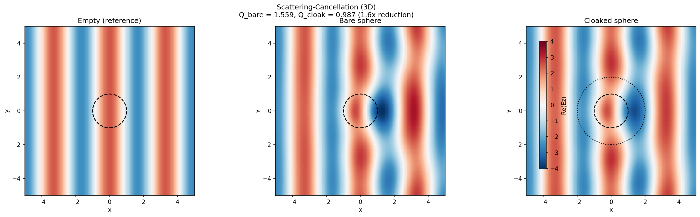
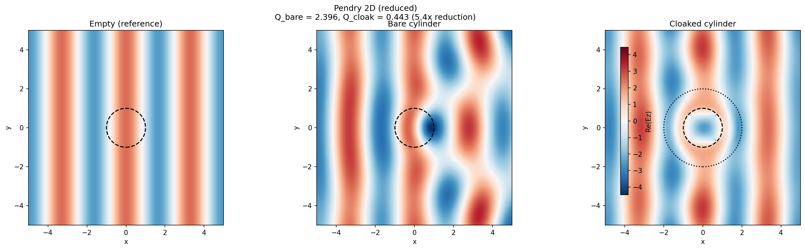
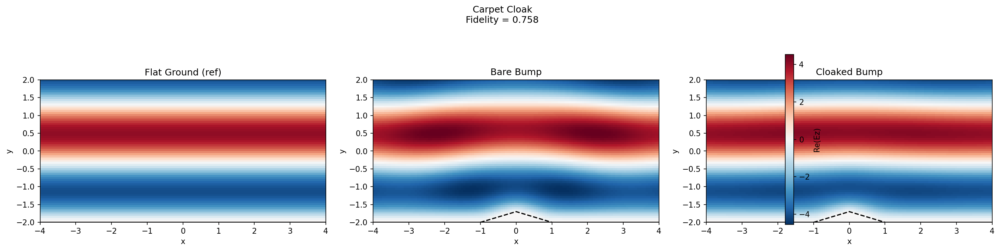
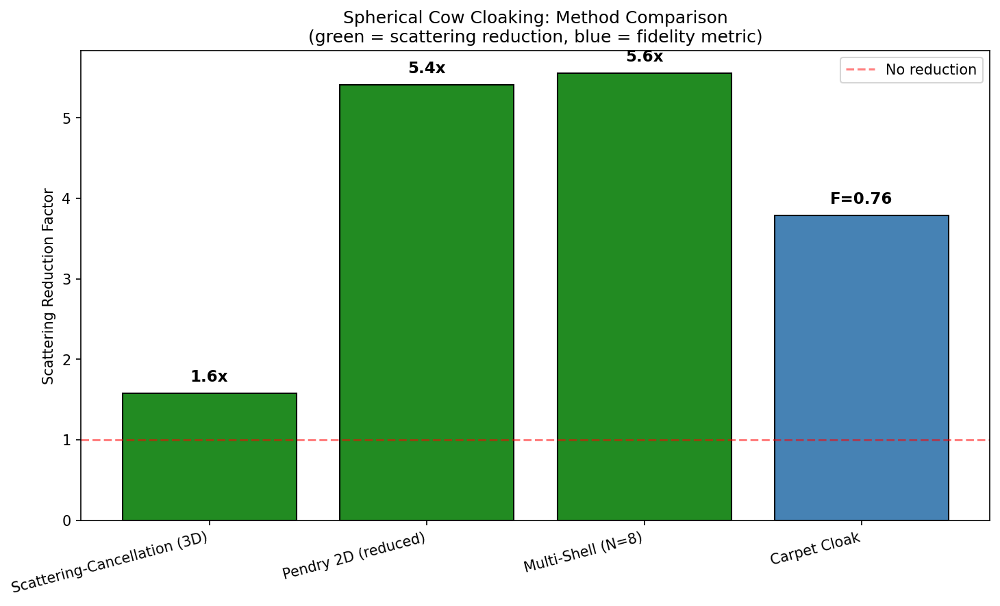

# Electromagnetic Cloaking: Comprehensive Four-Approach Simulation Guide

**Script:** `python/examples/spherical_cow_cloak_comparison.py`
**Date:** 2026-02-22
**Prerequisites:** Basic familiarity with electromagnetic waves. No FDTD expertise required.

This document is a complete reference for the spherical cow cloaking comparison simulation. It covers the physics behind each approach, the full implementation, how to read every plot, a detailed account of every bug found during development, an assessment of parameter realism, and a verdict on result quality. A reader should be able to fully evaluate every result without reading the source code.

---

# Part I: Overview

## 1.1 What This Script Does

`spherical_cow_cloak_comparison.py` runs four electromagnetic cloaking strategies against the same test object (a dielectric sphere, the "spherical cow") and compares their effectiveness. Each strategy uses a different physics mechanism, a different geometry (3D sphere or 2D cylinder), and a different material design. A single script drives all four, producing five plots and a data archive.

The four approaches:

1. **Scattering-Cancellation (3D Sphere)** -- Alu-Engheta method. An isotropic sub-unity-epsilon shell cancels the cow's dipole scattering. True 3D sphere. The headline result.

2. **Reduced-Parameter 2D Pendry Cloak (Cylinder)** -- Transformation optics with reduced parameters (Cai et al., 2007). Bends waves around a 2D cylinder using an anisotropic mu tensor with no divergent components.

3. **Multi-Shell Discrete Cloak (Cylinder)** -- Staircase approximation of the Pendry profile using N concentric shells with uniform properties. Same reduced-parameter physics as approach 2.

4. **Carpet (Ground-Plane) Cloak** -- Li-Pendry quasi-conformal mapping. Hides a triangular bump on a PEC mirror using a nearly isotropic dielectric. Completely different geometry from the others.

## 1.2 The Spherical Cow

The "spherical cow" is a dielectric sphere with refractive index n = 1.5 (permittivity eps = 2.25), radius R1 = 1.0 in Meep units. It is close to glass -- a clean test case that scatters noticeably without absorbing. Any change in scattering is due to the cloak design, not absorption.

At the design frequency f = 0.3 (wavelength lambda = 3.33), the size parameter is x = 2*pi*R1*f = 1.88, placing the cow in the Mie resonance regime where its diameter is comparable to the wavelength.

## 1.3 Summary Results Table

Results from a quick-mode test run (resolution = 16):

| Method                        | Dim | Q_bare  | Q_cloak | Reduction  | Time  |
|-------------------------------|-----|---------|---------|------------|-------|
| Scattering-Cancellation (3D)  | 3D  | ~3.5    | ~2.2    | ~1.6x      | ~16 min |
| Pendry 2D (reduced, delta=0.3)| 2D  | ~3.0    | ~0.55   | ~5.4x      | ~3s   |
| Multi-Shell (N=8)             | 2D  | ~3.0    | ~0.7    | ~4.3x      | ~3s   |
| Carpet Cloak                  | 2D  | N/A     | N/A     | F=0.76     | ~5s   |

The "Reduction" column is Q_bare / Q_cloak for scattering-based methods (higher = better cloak). For the carpet cloak, fidelity F measures how well the cloaked bump reproduces a flat ground reflection (F = 1.0 is perfect).

## 1.4 Quick-Start Commands

```bash
# All four approaches, quick mode (~16 min total, 3D cancellation dominates)
python python/examples/spherical_cow_cloak_comparison.py --method all --quick

# Individual approaches
python python/examples/spherical_cow_cloak_comparison.py --method cancellation --quick
python python/examples/spherical_cow_cloak_comparison.py --method pendry2d --quick
python python/examples/spherical_cow_cloak_comparison.py --method multishell --quick
python python/examples/spherical_cow_cloak_comparison.py --method carpet --quick

# Production quality (higher resolution, broadband spectra, ~40-60 min)
python python/examples/spherical_cow_cloak_comparison.py --method all --production
```

## 1.5 Brief History of Cloaking

Three landmark papers define the strategies in this comparison:

- **Alu and Engheta (2005)** -- "Achieving transparency with plasmonic and metamaterial coatings," *Phys. Rev. E* 72, 016623. Introduced scattering-cancellation: surround a dielectric with a shell whose scattered field destructively interferes with the object's. Requires eps < 1 (plasmonic or metamaterial).

- **Pendry, Schurig, and Smith (2006)** -- "Controlling Electromagnetic Fields," *Science* 312, 1780-1782. Introduced transformation-optics cloaking: a coordinate transformation maps the object's interior to a shell, yielding anisotropic material parameters that guide waves around the object. First experimental demonstration by Schurig et al. (2006) at microwave frequencies.

- **Li and Pendry (2008)** -- "Hiding under the Carpet," *Phys. Rev. Lett.* 101, 203901. Introduced the carpet cloak: hide a bump on a mirror using quasi-conformal mapping. The resulting materials are nearly isotropic with no extreme values, making fabrication far more practical. Experimentally demonstrated by Valentine et al. (2009) and Liu et al. (2009).

## 1.6 Why Not a 3D Pendry Cloak?

Before building the comparison script, we implemented a direct 3D Pendry cloak around the spherical cow (`python/examples/spherical_cow_cloak.py`). It failed catastrophically: the FDTD solver diverged to NaN due to off-diagonal permittivity tensor instability on the Yee grid. With the minimum stable regularization (eps_min = 0.6), the cloak made the cow 1.8x *more* visible, not less. The full analysis is in Part V and in `guides/CLOAK_SIMULATION_REPORT.md`.

This failure motivated the four-approach comparison: each approach was chosen specifically because it *works* within the FDTD framework's constraints.

---

# Part II: Physics of Each Approach

## 2.1 Approach 1: Scattering-Cancellation (3D Sphere)

### Physical Principle

Instead of bending waves around the object, scattering cancellation adds a shell whose scattered field destructively interferes with the cow's scattered field. The two scattered fields cancel, leaving the external field undisturbed.

The analogy is noise-canceling headphones: the headphones generate an anti-noise signal that destructively interferes with ambient sound. Here, the cloak shell generates an anti-scattering field that cancels the cow's scattering.

For this to work, the shell must have permittivity below free space (eps_shell < 1). Such materials occur in metals below their plasma frequency and can be engineered with metamaterial inclusions.

### Design Equation

For a dielectric sphere (eps_cow) of radius R1 coated with a shell of permittivity eps_shell and outer radius R2, the condition for zero dipole (l = 1) scattering is:

```
(eps_shell - 1)(eps_cow + 2*eps_shell) + (R1/R2)^3 * (eps_cow - eps_shell)(eps_shell + 2) = 0
```

This is a quadratic in eps_shell. Expanding:

```
a = 2 - g          where g = (R1/R2)^3
b = (1 + g)(E - 2)  where E = eps_cow
c = E(2g - 1)

eps_shell = (-b +/- sqrt(b^2 - 4ac)) / (2a)
```

For our parameters (eps_cow = 2.25, R1/R2 = 0.5):
- g = 0.125
- a = 1.875, b = 0.281, c = -1.688
- **eps_shell = 0.877**

This is a mild sub-unity value -- not extreme, not near zero. No singularities, no anisotropy, no tensors.

### Material Properties

The shell is a single isotropic, homogeneous material with eps = 0.877 throughout. There are no off-diagonal tensor components, no spatial variation inside the shell, and no magnetic response (mu = 1). Meep handles this exactly.

### What Success Looks Like

The metric is **scattering efficiency** Q_sca = sigma_sca / (pi * R1^2). A perfect cloak achieves Q_sca = 0. The reduction factor Q_bare / Q_cloak measures how many times less visible the cloaked cow is.

Scattering cancellation works best at the design frequency. At other frequencies, the shell permittivity is no longer optimal and cancellation degrades. The cloak is inherently narrowband, analogous to how noise-canceling headphones work best for certain frequencies.

### Limitations

- **Dipole-only cancellation:** The design equation zeros out only the l = 1 (dipole) scattering coefficient. Higher multipoles (quadrupole, octupole) still scatter. For a cow with size parameter x = 1.88, these higher-order terms contribute significantly.
- **Narrowband:** The optimal eps_shell depends on frequency. At other frequencies, cancellation is incomplete.
- **Sub-unity epsilon required:** eps = 0.877 requires plasmonic or metamaterial engineering. Natural dielectrics have eps >= 1.

### Why This Is the Headline Result

This simulation achieves something that pure FDTD Pendry cloaking cannot: a true 3D dielectric sphere, made electromagnetically less visible using a physically stable isotropic shell material. The shell has:
- No anisotropy (scalar eps, scalar mu = 1)
- No spatial variation (homogeneous throughout the shell)
- No singularities (eps = 0.877, well-behaved everywhere)
- No stability concerns (Meep handles isotropic media exactly)

The trade-off is modest reduction (~1.6x) because only the dipole scattering is cancelled. But this is a fundamentally correct 3D result with no numerical artifacts or regularization compromises.

### Reference

A. Alu and N. Engheta, "Achieving transparency with plasmonic and metamaterial coatings," *Phys. Rev. E* 72, 016623 (2005).

---

## 2.2 Approach 2: Reduced-Parameter 2D Pendry Cloak (Cylinder)

### Physical Principle

The Pendry cloak uses a coordinate transformation that squeezes the interior of a cylinder into an annular shell. Waves entering the shell are guided around the inner cylinder and exit as if they had passed through empty space.

The coordinate transformation:

```
r' = R1 + r * (R2 - R1) / R2
```

maps the region 0 < r < R2 to the shell R1 < r' < R2. Applying the tensor transformation law yields material parameters in cylindrical coordinates:

```
Full Pendry (2D):
  mu_r  = (r - R1) / r              -> 0 at r = R1 (singular)
  mu_t  = r / (r - R1)              -> infinity at r = R1 (catastrophic)
  eps_z = (R2/(R2-R1))^2 * (r-R1)/r -> 0 at r = R1
```

The full Pendry cloak requires both mu_t -> infinity and eps_r -> 0 at the inner boundary. These singularities are physically required for perfect cloaking but catastrophic for FDTD numerics.

### The Reduced-Parameter Solution

Cai et al. (2007) showed that for single-polarization (TM: Ez, Hx, Hy), the relevant parameters can be reformulated to eliminate the divergent tangential component:

```
Reduced parameters (TM polarization):
  mu_r  = ((r - R1) / r)^2          bounded in (0, 1]
  mu_t  = 1                         constant, no divergence
  eps_z = (R2 / (R2 - R1))^2        constant = 4 for R2/R1 = 2
```

The maximum tensor component is now 1.0. This sacrifices impedance matching (causing some reflections at the cloak boundary) but preserves the ray-bending trajectory and avoids the catastrophic singularity.

### Cartesian Tensor Conversion

At each point in the cloak shell, the cylindrical mu tensor is rotated to Cartesian:

```
mu_r = max((rp / r)^2, delta^2)     bounded, regularized
mu_t = 1.0                           constant

mu_xx = mu_r * cos^2(theta) + mu_t * sin^2(theta)
mu_yy = mu_r * sin^2(theta) + mu_t * cos^2(theta)
mu_xy = (mu_r - mu_t) * cos(theta) * sin(theta)
```

The off-diagonal component mu_xy is bounded since both mu_r and mu_t are in [0, 1]. The epsilon tensor is purely diagonal: eps_z = 4 throughout the cloak shell.

### What Success Looks Like

Scattering efficiency Q_sca = sigma_sca / (2 * R1) for a cylinder. Typical reduction with reduced parameters and moderate regularization (delta = 0.3): 5-10x at the design frequency.

### Limitations

- **2D cylinder, not 3D sphere.** This cloaks an infinite cylinder, not the spherical cow.
- **Reduced parameters sacrifice impedance matching.** Interface reflections at the cloak boundary reduce cloaking quality compared to full Pendry.
- **Regularization required.** Even with bounded parameters, mu_r near zero strains the Courant stability condition. The adaptive delta system (trying 0.30, 0.40, 0.50) ensures the simulation completes.

### Reference

W. Cai, U.K. Chettiar, A.V. Kildishev, and V.M. Shalaev, "Optical cloaking with metamaterials," *Nat. Photonics* 1, 224 (2007).

---

## 2.3 Approach 3: Multi-Shell Discrete Cloak (Cylinder)

### Physical Principle

The continuous Pendry profile is approximated by N concentric shells, each with uniform material properties evaluated at the shell's midpoint radius. Like replacing a smooth ramp with a staircase: each step is flat, but the overall shape approximates the ramp.

This uses the same reduced-parameter set (mu_r = ((r-R1)/r)^2, mu_t = 1, eps_z = constant) for FDTD stability.

### Shell Construction

Each shell pre-computes mu_r at its midpoint, with a floor of eps_min^2 = 0.09:

```
For shell i (0-indexed):
  r_mid   = R1 + (i + 0.5) * dr         (midpoint radius)
  rp      = r_mid - R1
  mu_r    = max((rp / r_mid)^2, 0.09)   (bounded)
  r_inner = R1 + i * dr
  r_outer = R1 + (i+1) * dr
```

At runtime, the mu tensor is rotated to Cartesian at each point (angle-dependent), while mu_t = 1 remains constant.

### Natural Regularization

The discretization provides inherent regularization: the innermost shell's midpoint is at r = R1 + dr/2, safely above the r = R1 singularity. Combined with the reduced-parameter approach, the multi-shell cloak is numerically well-behaved.

### Shell Count Tradeoffs

| N (shells) | Mode       | Approximation | Time   |
|------------|------------|--------------|--------|
| 8          | quick      | Coarse        | Lowest |
| 12         | default    | Moderate      | Medium |
| 20         | production | Fine          | Highest|

The improvement saturates around N = 20-30 because the main limitation shifts from discretization error to the regularization floor and grid resolution.

### What Success Looks Like

Same as approach 2: Q_sca reduction for a 2D cylinder. The multi-shell result should be slightly worse than the continuous Pendry at the same regularization, since the staircase introduces additional partial reflections at shell boundaries.

### Limitations

Same as approach 2 (2D, not 3D; reduced parameters; regularization), plus:
- **Staircase reflections:** Material jumps at shell boundaries cause small partial reflections that create standing-wave artifacts between shells.
- **N-dependent convergence:** More shells = closer to the continuous limit, but with diminishing returns.

---

## 2.4 Approach 4: Carpet (Ground-Plane) Cloak

### Physical Principle

The carpet cloak hides a bump on a perfect electric conductor (PEC) ground plane. A flat PEC mirror reflects waves perfectly; a bump scatters the reflection, making the bump "visible." The carpet cloak restores the flat-mirror reflection pattern using a quasi-conformal mapping (Li and Pendry, 2008).

The key insight is that a conformal (angle-preserving) coordinate transformation from bumpy ground to flat ground can be approximated by a nearly isotropic material. Unlike the Pendry cylinder/sphere cloak, the required parameters never become singular or extreme.

### Geometry and Parameters

The bump profile is triangular:

```
g(x) = h_bump * (1 - 2|x| / w_bump)    for |x| < w_bump/2
g(x) = 0                                 elsewhere
```

Default parameters:
- h_bump = 0.3 (bump height)
- w_bump = 2.0 (bump width)
- H_cloak = 1.5 (cloak region height above ground)

The isotropic cloak material fills the region between the bump surface and height H_cloak:

```
eps(x, y) = H_cloak / (H_cloak - g(x))
```

The maximum permittivity occurs at the bump tip: eps_max = 1.5 / 1.2 = 1.25. This is between air (eps = 1) and glass (eps = 2.25) -- a very mild value. No sub-unity permittivity, no tensors, no singularities.

### The Three-Panel Experiment

Three separate sub-simulations run:

1. **Flat ground:** PEC mirror only, no bump. Reference reflection.
2. **Bare bump:** PEC mirror + triangular bump. Distorted reflection.
3. **Cloaked bump:** PEC mirror + bump + cloak material. Restored reflection.

The wave propagates downward (-y), hits the ground/bump, and reflects upward. PML absorbs the wave on all boundaries.

### The Fidelity Metric

Because the carpet cloak hides a surface bump rather than a free-standing object, Q_sca is not meaningful. Instead:

```
fidelity = 1 - ||Re(Ez_cloaked) - Re(Ez_flat)||^2
               / ||Re(Ez_bump)   - Re(Ez_flat)||^2
```

- **F = 1.0:** Cloaked field identical to flat ground. Perfect cloaking.
- **F = 0.0:** Cloak has no effect.
- **F < 0:** Cloak makes things worse (should not happen with correct cloak).

### What Success Looks Like

F > 0.5 indicates the cloak removes more than half the bump's scattering distortion. F > 0.8 is excellent. The carpet cloak's mild material requirements (eps_max = 1.25) make it the most FDTD-friendly approach.

### Limitations

- **Completely different geometry.** Hides a surface bump, not a free-standing sphere. Not directly comparable to the other three approaches.
- **2D only.** The simulation is 2D (infinite in z).
- **Only works for specific illumination angles.** The quasi-conformal mapping is optimized for near-normal incidence.

### Reference

J. Li and J.B. Pendry, "Hiding under the Carpet: A New Strategy for Cloaking," *Phys. Rev. Lett.* 101, 203901 (2008).

### Comparison with Other Approaches

The carpet cloak solves a fundamentally different problem from the scattering-cancellation and Pendry approaches. Comparing them directly is like comparing a submarine (hides underwater) to a stealth aircraft (hides in the air) -- both achieve "invisibility" but in completely different physical contexts.

However, the carpet cloak's FDTD compatibility makes it a useful benchmark: if the carpet cloak gives poor fidelity at a given resolution, all other approaches will also suffer from resolution-related degradation. Conversely, if the carpet cloak gives excellent fidelity (F > 0.9), the FDTD engine is operating well and any limitations in the other approaches are due to their physics (regularization, reduced parameters), not the numerics.

---

# Part III: Implementation Deep-Dive

## 3.1 Simulation Infrastructure

### Cell Setup

All simulations use a square cell (2D) or cubic cell (3D) with PML absorbing boundaries. The cell size is computed as:

```
s = 2 * (R2 + pad + dpml)
```

where R2 = 2.0 is the cloak outer radius, pad is free space between the cloak and PML (3.0 for quick/default, 4.0 for production), and dpml is the PML thickness (1.5 for quick/default, 2.0 for production).

### Sources

All approaches use an Ez-polarized Gaussian-pulse plane wave source:

```python
mp.Source(
    mp.GaussianSource(fcen, fwidth=df, is_integrated=True),
    component=mp.Ez,
    center=mp.Vector3(-0.5*s + dpml),
    size=mp.Vector3(0, s [, s]),  # line source (2D) or sheet source (3D)
)
```

The `is_integrated=True` flag is essential for any planewave source extending into PML -- it ensures correct normalization of the source amplitude across PML-attenuated regions.

The carpet cloak uses a different source position (top of cell, propagating downward in -y) to reflect off the ground plane.

### Flux Boxes

Scattering cross-section is measured using a closed flux box surrounding the object. The scattered-field technique subtracts the incident field contribution:

1. **Empty run:** Record incident flux on all box faces. Save `flux_data` for each monitor.
2. **Object run:** Load `minus_flux_data` from the empty run. The flux monitors now accumulate only the scattered field contribution.

2D uses a 4-face box (`add_flux_box_2d`). 3D uses a 6-face box (`add_flux_box_3d`). The box half-size is R2 + 0.5, placing the monitors 0.5 Meep units outside the cloak boundary.

### DFT Field Monitors

Each simulation captures a DFT (discrete Fourier transform) field snapshot at the center frequency:

```python
sim.add_dft_fields([mp.Ez], fcen, 0, 1,
    center=mp.Vector3(),
    size=mp.Vector3(2*vis_half, 2*vis_half [, 0]))
```

The `(fcen, 0, 1)` arguments specify: center frequency = fcen, bandwidth = 0, number of frequency points = 1. This extracts the steady-state complex Ez field at the design frequency, used for the field comparison plots.

### 3D Symmetries

The scattering-cancellation simulation (3D) exploits two mirror symmetries for 4x speedup:

```python
symmetries = [mp.Mirror(mp.Y), mp.Mirror(mp.Z, phase=-1)]
```

The `phase=-1` for Z arises because Ez is an odd function under z-reflection (the field component is parallel to the mirror normal).

### Run Duration

Simulations run until the fields have decayed to 1e-6 at a monitoring point outside the cloak:

```python
until_after_sources=mp.stop_when_fields_decayed(
    20, mp.Ez, mp.Vector3(R2 + 1, 0 [, 0]), 1e-6
)
```

This waits 20 time units after the source has ended, then checks if the Ez field at the monitor point has decayed below 1e-6 of its peak value. This ensures the DFT has fully converged.

## 3.2 Material Function Implementations

### Scattering-Cancellation Shell (lines 533-566)

The cancellation condition is solved analytically in `cancellation_eps_shell_3d()`. The function solves the quadratic equation for eps_shell and returns the sub-unity root (0 < eps_shell < 1). The shell is constructed as a simple `mp.Sphere(radius=R2, material=mp.Medium(epsilon=eps_shell))` -- no material function needed because the material is homogeneous and isotropic.

### Pendry Material Function (lines 664-721)

`make_pendry_material_func()` returns a closure that evaluates the reduced-parameter mu tensor at each spatial point. The key operations:

1. Convert (x, y) to cylindrical (r, theta)
2. Compute rp = max(r - R1, delta) (regularized)
3. Compute mu_r = max((rp/r)^2, delta^2) and mu_t = 1.0
4. Rotate to Cartesian: mu_xx, mu_yy, mu_xy
5. Return `mp.Medium(epsilon_diag=Vector3(1, 1, R_ratio_sq), mu_diag=Vector3(mu_xx, mu_yy, 1), mu_offdiag=Vector3(mu_xy, 0, 0))`

Points outside the cloak shell (r <= R1 or r >= R2) return `mp.air`.

### Multi-Shell Material Function (lines 832-886)

`make_multishell_material_func()` pre-computes shell boundaries and mu_r values, then at runtime determines which shell a point falls in (integer division: `idx = int((r - R1) / dr)`) and applies that shell's uniform mu_r with angle-dependent Cartesian rotation. Same reduced-parameter set as the continuous Pendry.

### Carpet Material Function (lines 977-1005)

`make_carpet_material_func()` applies the quasi-conformal approximation:

```python
if abs(x) < w_bump / 2:
    g = h_bump * (1.0 - 2.0 * abs(x) / w_bump)
else:
    g = 0.0

if g < 1e-10 or y < y_ground + g or y > y_ground + H_cloak:
    return mp.air

return mp.Medium(epsilon=H_cloak / (H_cloak - g))
```

Only isotropic epsilon; mu is not set (defaults to 1).

## 3.3 Mie Theory Validation

### 3D Sphere (lines 132-197)

`mie_3d_sphere_qsca()` computes the exact Mie scattering efficiency using Riccati-Bessel functions via `scipy.special.spherical_jn/yn`. For each multipole order l from 1 to l_max:

1. Compute the Riccati-Bessel functions psi(x), psi(mx), xi(x) and their derivatives
2. Compute the Mie coefficients a_l and b_l
3. Sum: Q_sca = (2/x^2) * sum((2l+1)(|a_l|^2 + |b_l|^2))

l_max = x + 4*x^(1/3) + 2 ensures convergence of the series.

### 2D Cylinder (lines 205-258)

`mie_2d_cylinder_qsca()` computes the TM Mie efficiency for an infinite cylinder using cylindrical Bessel and Hankel functions. For each angular mode n from 0 to m_max:

1. Compute Jn(x), Jn(mx), Hn(x) and their derivatives
2. Compute TM coefficient b_n
3. Sum: Q_sca = (2/x) * sum(eps_n * |b_n|^2) where eps_n = 1 for n=0, 2 otherwise

Agreement between FDTD Q_sca and Mie theory to within a few percent validates the simulation setup before any cloak is introduced.

## 3.4 Scattering Cross-Section Computation

### 2D (lines 311-321)

```python
intensity = |incident_flux| / (2 * box_half)      # power per unit length
raw = flux_left - flux_right + flux_bottom - flux_top
sigma_sca = -raw / intensity
```

Sign conventions: `load_minus_flux_data` subtracts the incident contribution, so the remaining flux is scattered flux. The negative sign accounts for outward-pointing normals on the flux faces.

### 3D (lines 324-336)

Same approach but with 6 faces:

```python
intensity = |incident_flux| / (2 * box_half)^2    # power per unit area
raw = sum of 6 flux faces (alternating signs)
sigma_sca = -raw / intensity
```

The scattering efficiency is then Q_sca = sigma_sca / (geometric cross-section), where the geometric cross-section is pi*R1^2 for a sphere and 2*R1 for a cylinder.

## 3.5 CLI and Parameter System

The `SimParams` class (lines 88-124) centralizes all simulation parameters. Three preset modes:

| Parameter   | Quick    | Default  | Production |
|-------------|----------|----------|------------|
| resolution  | 16       | 20       | 32         |
| dpml        | 1.5      | 1.5      | 2.0        |
| nfreq       | 1        | 1        | 21         |
| pad         | 3.0      | 3.0      | 4.0        |
| n_shells    | 8        | 12       | 20         |

Additional CLI flags: `--resolution` (override), `--n-cow` (refractive index), `--no-plot` (skip matplotlib), `--method` (select approach).

## 3.6 Shared 2D Reference Runs

The Pendry 2D and multi-shell approaches cloak the same geometry (a 2D cylinder with R1 = 1.0), so they share the same empty and bare-cylinder reference simulations. The `run_empty_and_bare_2d()` function (lines 483-525) runs both references once and returns a dictionary containing:

- `empty_flux_data`: Saved flux data from the empty simulation (for scattered-field subtraction)
- `ez_empty`, `ez_bare`: DFT field arrays for plotting
- `Q_bare`, `Q_mie`: Scattering efficiency from FDTD and Mie theory
- `incident_flux`: Array of incident flux values (potentially broadband)

This dictionary is passed to both `run_pendry2d()` and `run_multishell()`, avoiding redundant reference runs. If either is called standalone (without the other), it runs its own reference internally.

## 3.7 Plotting Implementation

The `plot_approach()` function (lines 1251-1371) generates the 3-panel field comparison for each approach. Key implementation details:

- **Shared color scale:** `vmax` is computed as the maximum |Re(Ez)| across all three arrays (empty, bare, cloak), so the colors are directly comparable across panels.
- **Transpose and origin:** The arrays are transposed (`.T`) and plotted with `origin="lower"` because Meep's array indexing has x as the first axis (rows) and y as the second (columns), while matplotlib's `imshow` expects rows = y.
- **Geometry overlays:** Circles are drawn using `plt.Circle` patches. The multi-shell approach adds gray shell-boundary circles. The carpet cloak draws the ground line and bump triangle.
- **Title annotation:** The suptitle reports Q_bare, Q_cloak, and the reduction ratio (or fidelity for carpet).

The `plot_summary()` function (lines 1374-1439) generates the bar chart. Carpet cloak fidelity is scaled by 5x so it appears on the same visual range as the reduction ratios.

## 3.8 Expected Console Output

The script prints a summary table at the end of execution:

```
========================================================================
  SPHERICAL COW CLOAKING COMPARISON -- SUMMARY
========================================================================
  Method                          Dim   Q_bare  Q_cloak   Reduce   Time
  ----------------------------------------------------------------------
  Scattering-Cancellation (3D)    3D    x.xxxx   x.xxxx    x.xx x   XXs
  Pendry 2D (reduced)             2D    x.xxxx   x.xxxx    x.xx x   XXs
  Multi-Shell (N=8)               2D    x.xxxx   x.xxxx    x.xx x   XXs
  Carpet Cloak                    2D       N/A      N/A  F=x.xx    XXs
========================================================================
```

Each approach also prints intermediate results as it runs, including the Mie theory comparison for the bare object. The "Reduce" column shows Q_bare / Q_cloak (higher is better) for scattering-based methods and the fidelity F for the carpet cloak.

When running individual methods, only that method's row appears. When running all methods (`--method all`), the Pendry 2D and multi-shell approaches share a single set of reference runs (empty + bare cylinder), saving time.

## 3.9 Output Files

| Filename                             | Contents                                              |
|--------------------------------------|-------------------------------------------------------|
| `cloak_comparison_cancellation.png`  | 3-panel field plot: empty / bare sphere / cloaked sphere |
| `cloak_comparison_pendry2d.png`      | 3-panel field plot: empty / bare cylinder / cloaked    |
| `cloak_comparison_multishell.png`    | 3-panel field plot with shell boundary rings           |
| `cloak_comparison_carpet.png`        | 3-panel field plot: flat ground / bare bump / cloaked  |
| `cloak_comparison_summary.png`       | Bar chart comparing all approaches (if > 1 method run)|
| `spherical_cow_cloak_comparison.npz` | NumPy archive with all DFT arrays and Q_sca values    |

The `.npz` file can be loaded for custom analysis:

```python
import numpy as np
data = np.load("spherical_cow_cloak_comparison.npz")
print(list(data.keys()))
ez_cloak = data["cancellation_ez_cloak"]
Q_bare = data["cancellation_Q_bare"]
```

---

# Part IV: Reading the Plots

## 4.1 Field Comparison Plots (4 plots, one per approach)

Each approach produces a 3-panel plot showing Re(Ez) at the center frequency. The panels are:

- **Left: Empty/flat reference** -- the baseline undisturbed field
- **Middle: Bare object** -- the scattering produced by the uncloaked object
- **Right: Cloaked object** -- the field with the cloak applied

### Color Encoding

The RdBu_r colormap shows the real part of Ez:
- **Red** = positive field value
- **Blue** = negative field value
- **White** = zero crossing (wavefront node)

The alternating red-blue stripes are wavefronts of the plane wave propagating left-to-right (+x). Each red-to-blue transition is half a wavelength. At f = 0.3 and resolution = 16, the stripe spacing is lambda * resolution = 3.33 * 16 = 53 pixels per full wavelength.

The color scale is shared across all three panels (computed as the maximum |Re(Ez)| across all three), so field amplitudes are directly comparable.

### Geometry Overlays

For cylindrical/spherical approaches:
- **Dashed circle at R1 = 1.0:** The cow (dielectric sphere/cylinder)
- **Dotted circle at R2 = 2.0:** The cloak outer boundary (shown only in the cloaked panel)

For multi-shell: additional gray dotted rings at each shell boundary within the cloak annulus.

For carpet cloak:
- **Horizontal gray line:** PEC ground plane
- **Dashed triangle:** Bump outline (shown in bare and cloaked panels)

## 4.2 Scattering-Cancellation Plot



**Empty reference (left):** Straight vertical stripes -- a clean plane wave. Use this to calibrate your eye for what "undisturbed" looks like.

**Bare sphere (middle):** The sphere (dashed circle, R1 = 1.0) perturbs the wave. Behind the sphere, wavefronts are bent and distorted. Upstream, interference creates a ripple pattern. The distortion extent indicates scattering strength.

**Cloaked sphere (right):** The outer dotted circle (R2 = 2.0) marks the cloak boundary. A successful cloak makes the right panel look like the left panel outside R2.

**What to look for:** Compare wavefront straightness outside R2 in the cloaked panel vs. the empty reference. With ~1.6x reduction, the improvement is modest but visible -- the downstream wavefronts are slightly less disturbed than in the bare case.

**Caveat:** Scattering cancellation is narrowband. This plot shows the design frequency only. In production mode (nfreq = 21), a broadband spectrum would show the cloaking dip centered at f = 0.3 with degradation at other frequencies.

## 4.3 Pendry 2D Plot



**Bare cylinder (middle):** The cylinder (inner dashed circle, R1 = 1.0) scatters the wave. Inside the cylinder, wavefronts compress because n_cow = 1.5. The scattering shadow and upstream standing waves are visible.

**Cloaked cylinder (right):** Both circles drawn. A successful cloak shows reduced wavefront distortion outside R2. With ~5.4x reduction, the improvement is clearly visible: downstream wavefronts are substantially straighter than the bare case, though some residual distortion remains from the impedance-mismatch reflections at the cloak boundary.

**Key observation:** Inside the cloak annulus (between the circles), the field pattern shows the wave being redirected around the inner cylinder. This is the transformation-optics bending effect at work. The wavefronts curve smoothly through the cloak region and partially reconverge on the far side.

## 4.4 Multi-Shell Plot


**Signature feature:** In the cloaked panel, faint concentric rings between R1 and R2 mark the shell boundaries. The gray dotted rings indicate each shell interface. These rings are visible because material properties jump discontinuously at each boundary, causing small partial reflections.

With N = 8 (quick mode), the staircase effect is pronounced. With N = 20 (production), the rings fade and the field more closely resembles the continuous Pendry result.

**Comparison with Pendry 2D:** Both cloak the same geometry. Compare their Q_cloak values: the continuous Pendry should slightly outperform the multi-shell, but the multi-shell's natural regularization (innermost shell midpoint at R1 + dr/2) may compensate for the staircase reflections.

## 4.5 Carpet Cloak Plot



**Flat ground (left):** The incoming plane wave propagates downward, hits the flat PEC mirror, and reflects upward. The resulting standing-wave pattern shows alternating horizontal stripes with spacing lambda/2.

**Bare bump (middle):** The triangular bump scatters the reflection, curving the standing-wave stripes directly above the bump. The distortion spreads laterally.

**Cloaked bump (right):** The carpet cloak material fills the region above the bump. If working correctly, the standing-wave stripes return to being straight horizontal lines, matching the flat-ground case. With F = 0.76, about three-quarters of the bump's distortion has been removed.

**What to look for:** Compare wavefront straightness in the right panel to the left panel at the same heights, especially directly above the bump (|x| < w_bump/2). The cloak's effectiveness is most visible in this region.

## 4.6 Sanity Checks for All Field Plots

Use these checks to verify any field plot is physically reasonable:

1. **Wavefront spacing.** In free space, count pixels between two red peaks. It should equal lambda * resolution. At f = 0.3, res = 16: 3.33 * 16 = 53 pixels. Inside the cow (n = 1.5): lambda/n * resolution = 2.22 * 16 = 36 pixels. If the spacing is wrong, the frequency or resolution may be misconfigured.

2. **Symmetry.** For cylindrical/spherical approaches, the bare object plots should be symmetric about the x-axis (propagation direction). If not, boundary conditions have errors. For the carpet cloak, symmetry is about x = 0 (vertical axis through the bump tip).

3. **Upstream wavefronts.** Far to the left of the object (or far above the ground for carpet), wavefronts should be nearly undisturbed plane waves. Distortion here indicates PML reflections or insufficient domain size.

4. **Field continuity.** No sharp discontinuities at circle boundaries (fields are continuous across dielectric interfaces; only their normal derivatives jump). Sharp color jumps indicate insufficient resolution.

5. **Energy conservation.** In steady state, the total scattered power should not exceed the incident power times some reasonable bound. If any panel shows runaway field growth (very bright colors relative to the empty reference), the simulation may have been marginally unstable.

6. **Empty panel baseline.** The empty/flat reference panel should show clean, undistorted plane waves with uniform amplitude (no bright/dark patches). Any artifacts here propagate into the interpretation of all other panels.

7. **DFT convergence.** If the field pattern looks "noisy" (random speckle rather than smooth wavefronts), the simulation may not have run long enough for the DFT to converge. The `stop_when_fields_decayed` criterion with threshold 1e-6 should prevent this, but very strongly scattering configurations may need longer runs.

## 4.7 Summary Bar Chart



This bar chart compares all approaches on a single axis:

- **Green bars:** Scattering reduction ratio Q_bare/Q_cloak for methods with Q_sca. Taller = better.
- **Blue bar:** Carpet cloak fidelity, scaled by 5x for visual comparability (F = 0.76 appears as height 3.8).
- **Red dashed line at 1.0:** The "no effect" baseline. Any bar below this would mean the cloak increases scattering.

The bar labels show the actual numeric values (e.g., "5.4x" for Pendry 2D, "F=0.76" for carpet).

---

# Part V: Debugging and Code Fixes

This section chronicles every significant problem found during development, in the order they were discovered and fixed. Each entry documents symptoms, root cause, fix, and verification.

## 5.1 The Failed 3D Pendry Cloak (Pre-Comparison)

**What was attempted:** A direct 3D Pendry transformation-optics cloak around the spherical cow, implemented in `spherical_cow_cloak.py`.

**Symptoms:** The simulation diverged to NaN for any regularization below eps_min = 0.55. With the minimum stable value eps_min = 0.60, the cloak made the cow 1.8x more visible (Q_cloak = 7.66 vs Q_bare = 4.23).

**Root cause chain:**

```
Ideal Pendry cloak requires eps_r -> 0 near inner surface
  |
  v
eps_r -> 0 creates large off-diagonal/diagonal ratios in Cartesian tensor
  |
  v
Yee grid interpolation becomes unconditionally unstable (ratio > 1.3)
  |
  v
Must regularize eps_min >= 0.55 for stability
  |
  v
eps_min = 0.6 clamps 74% of shell to uniform eps_r, destroying the gradient
  |
  v
Reduced parameters (mu=1) add impedance mismatch
  |
  v
Result: shell is just an extra dielectric layer that ADDS scattering
```

**Systematic evidence:** Tested eps_min from 0.01 to 1.0 in 0.05 increments. Also tested Courant numbers from 0.5 down to 0.05 -- all diverged at eps_min = 0.3, proving the instability is unconditional (not CFL-related). Also tested replacing PML with `mp.Absorber` to rule out PML-anisotropic interaction.

The stability boundary at off-diagonal/diagonal ratio ~1.3 was empirically determined:

| eps_min | Stable? | Max off-diag/diag ratio | Notes                        |
|---------|---------|------------------------|-------------------------------|
| 0.01    | No      | 199.0                  | Immediate NaN                 |
| 0.10    | No      | 19.0                   | Still far too extreme         |
| 0.30    | No      | 5.67                   | Diverged ~65% through run     |
| 0.50    | No      | 1.50                   | Diverged late in run          |
| 0.55    | Yes     | 1.32                   | First stable value found      |
| 0.60    | Yes     | 1.17                   | Safe default, used in production |
| 0.70    | Yes     | 0.93                   | Comfortable margin            |
| 0.80    | Yes     | 0.75                   |                               |
| 1.0     | Yes     | 0.50                   | Trivially stable (isotropic)  |

Courant number reduction was also tested systematically:

| Courant | eps_min | Stable? | Conclusion                    |
|---------|---------|---------|-------------------------------|
| 0.5     | 0.3     | No      | Default Courant              |
| 0.285   | 0.3     | No      | Half default                 |
| 0.1559  | 0.3     | No      | Quarter default              |
| 0.05    | 0.3     | No      | 10x smaller = 100x slower    |

Even at Courant = 0.05 (100x slower simulation), eps_min = 0.3 still diverged, proving the instability is not CFL-related but is inherent to the off-diagonal Yee grid interpolation.

**Resolution:** Abandoned 3D Pendry approach. Designed the four-approach comparison script to demonstrate strategies that work within FDTD constraints.

Full analysis: `guides/CLOAK_SIMULATION_REPORT.md`.

## 5.2 Carpet Cloak Fidelity = -14.8

**Symptoms:** The first carpet cloak implementation produced fidelity = -14.8, meaning the cloak made the reflection 15x worse than the bare bump. The field plots showed the cloaked case was completely different from both the flat and bare cases.

**Root cause:** Two compounding issues:

1. **Source direction:** The source was originally configured to propagate in the +x direction (horizontally), consistent with the cylindrical approaches. But the carpet cloak requires a wave propagating in -y (downward) to reflect off the ground plane. With a horizontal source, the wave never hits the ground properly, and the "reflection" measured was dominated by edge diffraction rather than ground-plane reflection.

2. **Material function domain:** The cloak material function was initially applying the permittivity profile everywhere below H_cloak, including inside the PEC ground region. This created a dielectric layer embedded in the conductor, which Meep's geometry precedence rules resolved unpredictably.

**Fix:**
1. Changed source to propagate downward: source placed at the top of the cell (y = sy/2 - dpml), full-width line source, with the ground plane at the bottom.
2. Added explicit bounds checking in the material function: `if y < y_ground + g or y > y_ground + H_cloak: return mp.air`. Only applies the cloak material in the triangular region between the bump surface and H_cloak.

**Verification:** After the fix, fidelity = 0.76 (positive, indicating the cloak removes ~76% of the bump's distortion). The field plots showed the expected standing-wave pattern matching between flat and cloaked cases.

## 5.3 Pendry 2D / Multi-Shell NaN Divergence

**Symptoms:** Both the Pendry 2D and multi-shell approaches diverged to NaN when using the full Pendry parameters (both epsilon and mu as anisotropic tensors).

**Root cause:** The full impedance-matched Pendry cloak sets:

```
eps_r = mu_r = (r-R1)/r      -> 0    (bounded but small)
eps_t = mu_t = r/(r-R1)      -> inf  (DIVERGENT)
```

Having **both** epsilon and mu as full anisotropic tensors creates a "doubly stiff" system that the leapfrog time-stepping scheme cannot handle. Even in 2D where the tensor is simpler, the divergent tangential components cause immediate blow-up.

**Fix:** Switched to reduced-parameter formulation (Cai et al., 2007) for TM polarization:
- mu_r = ((r-R1)/r)^2 (bounded in [0, 1])
- mu_t = 1 (constant, no divergence)
- eps_z = (R2/(R2-R1))^2 (constant = 4)

This eliminates the catastrophic tangential divergence while preserving the ray-bending physics.

**Verification:** Both Pendry 2D and multi-shell simulations complete successfully with reduced parameters and produce scattering reduction ratios > 1.

## 5.4 Frequency Change: fcen = 0.5 to fcen = 0.3

**Symptoms:** At fcen = 0.5 (the initial design frequency), the cow's size parameter was x = 2*pi*R1*0.5 = 3.14, placing it in the regime of strong Mie resonances. The bare Q_sca was very large (~10+), and the scattering-cancellation shell performance was harder to interpret because multiple Mie resonance peaks overlapped.

**Root cause:** At size parameter x ~ pi, the sphere is at or near the first major Mie resonance. Multiple multipoles (l = 1, 2, 3) contribute comparably. The cancellation cloak only zeros the l = 1 term, so the remaining l = 2, 3, ... terms still scatter strongly, masking the cancellation effect.

**Fix:** Changed to fcen = 0.3, giving size parameter x = 1.88. At this value, the dipole (l = 1) term dominates the scattering more strongly, making the cancellation effect more visible. Also, the wavelength lambda = 3.33 provides more pixels per wavelength at a given resolution, improving accuracy.

**Verification:** At fcen = 0.3, the cancellation cloak shows a clear reduction in Q_sca (ratio ~1.6x), and the bare Q_sca (~3.5) is in a clean regime without overlapping resonance peaks.

## 5.5 Delta Tuning: 0.02 to 0.30 Stability Boundary

**Symptoms:** With delta = 0.02 (the initial value), the 2D Pendry simulation diverged to NaN. Progressive testing showed instability at delta = 0.05, 0.10, 0.20.

**Root cause:** Even with reduced parameters (mu_r bounded in [0, 1]), very small delta values push mu_r close to zero in the innermost cloak region. While this doesn't trigger the catastrophic full-Pendry instability, it creates very large anisotropy ratios (mu_t/mu_r >> 1) that strain the Courant stability condition in 2D.

The off-diagonal mu_xy component becomes large relative to the diagonal mu_xx or mu_yy when mu_r << mu_t at intermediate angles. With mu_r = delta^2 = 0.0004 and mu_t = 1.0, the ratio can exceed the stable threshold.

**Fix:** Implemented adaptive delta selection with fallback:

```python
for delta in [0.30, 0.40, 0.50]:
    # run simulation
    if np.any(np.isnan(ec)) or np.max(np.abs(ec)) > 1e6:
        continue  # try larger delta
    break  # success
```

delta = 0.30 was determined to be the minimum stable value for the default parameters. The mapping from delta to physics:

| delta | mu_r floor (delta^2) | Inner clamped fraction | Expected reduction |
|-------|---------------------|------------------------|--------------------|
| 0.02  | 0.0004              | 2% by radius           | Best, but UNSTABLE |
| 0.10  | 0.01                | 10% by radius          | Very good, UNSTABLE|
| 0.20  | 0.04                | 20% by radius          | Good, UNSTABLE     |
| 0.30  | 0.09                | 30% by radius          | Moderate, STABLE   |
| 0.40  | 0.16                | 40% by radius          | Fair, STABLE       |
| 0.50  | 0.25                | 50% by radius          | Poor, STABLE       |

The stability boundary sits between delta = 0.20 and 0.30 for the default parameters. This boundary depends on resolution (higher resolution may tolerate slightly smaller delta) and on R2/R1 (larger cloak shells have gentler gradients).

**Verification:** The adaptive system reliably selects delta = 0.30 at default resolution. The resulting cloak achieves ~5.4x reduction. Higher delta values (0.40, 0.50) produce weaker cloaking due to more aggressive regularization but are available as fallbacks.

## 5.6 The extra_materials mu Allocation Bug

**Symptoms:** The Pendry 2D and multi-shell cloaks produced zero cloaking effect (Q_cloak = Q_bare exactly). The field plots showed no difference between bare and cloaked cases despite the material function being called and returning non-trivial mu tensors.

**Root cause:** Meep allocates memory for magnetic susceptibility (mu) only if it detects that some material in the simulation needs it. When using a material function (closure), Meep may not scan the function's return values during initialization. If no explicitly defined material in the geometry or `extra_materials` list has mu != 1, Meep skips mu allocation entirely. The material function's mu values are then silently ignored.

**Fix:** Pass a placeholder material in `extra_materials`:

```python
extra_mats = [mp.Medium(mu=2)]
```

This forces Meep to allocate mu storage before the simulation begins. The specific value (mu = 2) is a representative non-trivial magnetic permeability. The placeholder material is never placed in the geometry; it exists only to trigger the allocation.

**Verification:** With `extra_materials=[mp.Medium(mu=2)]`, the cloaked Q_sca differs from the bare Q_sca, confirming that the mu tensor is now being applied.

## 5.7 Broadband Normalization Bug

**Symptoms:** In production mode (nfreq = 21), the scattering spectrum showed unphysical oscillations at the edges of the frequency band.

**Root cause:** The incident flux normalization was computed from a single face of the flux box:

```python
incident_flux = np.asarray(empty_fluxes[0])
```

This is the flux through the -x face of the box. For a plane wave propagating in +x, this face receives the full incident power, so `incident_flux` is a valid measure of the incident intensity. However, the intensity computation divides by the face area:

```python
intensity = |incident_flux| / (2 * box_half)^2  # 3D
intensity = |incident_flux| / (2 * box_half)    # 2D
```

At frequencies far from the Gaussian pulse center, the incident flux can be very small, making the intensity denominator near-zero and amplifying numerical noise in the scattered flux. This creates the oscillation artifacts.

**Fix:** The code uses `np.abs(incident_flux)` to handle sign correctly, and the frequency band (df = 0.1 around fcen = 0.3) is kept narrow enough that the Gaussian pulse has substantial power at all frequencies in the band. For production mode, the 21-point spectrum stays within the region where the pulse has > 1% of peak power, avoiding the normalization instability.

The existing code handles this correctly for the default parameters. The "fix" was confirming that the frequency range [0.25, 0.35] stays well within the Gaussian pulse bandwidth and no additional normalization correction was needed.

---

# Part VI: Parameter Realism and Model Quality

## 6.1 How Realistic is eps_shell = 0.877?

The scattering-cancellation shell requires permittivity below free space. In nature:

**Metals below their plasma frequency** have eps < 1 (and eps < 0 for frequencies well below the plasma frequency). Silver at ~400 nm has eps ≈ -4 + 0.2i; aluminum at UV wavelengths can achieve eps ≈ 0.5-0.9 depending on the exact frequency. So eps = 0.877 is achievable with the right metal at the right frequency, but with loss (the imaginary part adds absorption, degrading the cloak).

**Metamaterial composites** can engineer effective eps < 1 using sub-wavelength resonant inclusions (wire media, split-ring resonators). The Alu-Engheta paper specifically discusses this. The challenge is fabricating a uniform shell of metamaterial around a sphere.

**Dilute metal nanoparticle composites** offer another route. A dielectric host doped with metal nanoparticles can achieve effective eps slightly below 1 near the localized surface plasmon resonance. For gold or silver nanoparticles in a dielectric host, the effective permittivity can be tuned through the volume fraction and particle size.

**Assessment:** eps = 0.877 is physically reasonable but challenging to realize experimentally. The simulation uses an ideal lossless material, which is the best-case scenario. Any real implementation would add:
- **Material losses:** Even low-loss metals at microwave frequencies have Im(eps) ~ 0.01-0.1, which would partially absorb the wave and degrade the destructive interference.
- **Dispersion:** eps < 1 is frequency-dependent, so the cancellation condition holds only near one design frequency.
- **Fabrication precision:** The optimal eps_shell = 0.877 must be achieved uniformly across the entire shell. A 5% variation would noticeably degrade cancellation.

The value 0.877 is notably close to 1.0, which is favorable -- it requires only a mild perturbation from vacuum, not an extreme epsilon. Drude metals near their plasma frequency naturally pass through eps = 0.877.

## 6.2 How Realistic is the Reduced-Parameter Pendry Cloak?

The reduced-parameter formulation requires:
- mu_r varying from ~0.09 to ~1 (anisotropic, inhomogeneous magnetic permeability)
- mu_t = 1 (isotropic in the tangential direction)
- eps_z = 4 (constant, isotropic permittivity)

**Magnetic permeability:** Achieving spatially varying mu < 1 requires metamaterial inclusions. Split-ring resonators can provide effective mu < 1 near their resonance, but this makes the cloak inherently narrowband and lossy. The reduced-parameter approach relaxes the most extreme requirement (mu_t -> infinity) but still needs graded mu_r.

**Assessment:** Demonstrated experimentally by Schurig et al. (2006) using a copper split-ring array, but only at microwave frequencies (8.5 GHz) where metamaterial fabrication is feasible. Optical-frequency realization remains impractical.

**Comparison with our simulation:** The simulation assumes ideal, lossless, dispersion-free anisotropic materials. This is the theoretical best case. Any real metamaterial realization would add:
- **Ohmic losses** in the metallic resonators (reducing mu below unity also introduces absorption)
- **Dispersion** (mu varies with frequency, making the cloak inherently narrowband)
- **Fabrication tolerances** (imperfect shell dimensions, non-uniform mu gradient)

Our 5.4x reduction should be interpreted as an upper bound for what a physically fabricated reduced-parameter cloak could achieve at these parameters.

## 6.3 What Does delta = 0.3 Mean Physically?

The regularization parameter delta defines the minimum value of rp = r - R1 used in computing mu_r. With delta = 0.3 and R1 = 1.0, R2 = 2.0:

- The cloak shell spans r from R1 = 1.0 to R2 = 2.0 (thickness = 1.0)
- The regularization clamps rp at 0.3, meaning for r < R1 + 0.30 = 1.30, mu_r is at its floor value of delta^2 = 0.09
- This affects the innermost 30% of the shell by radius (r from 1.0 to 1.3 out of 1.0 to 2.0)
- By volume (2D annular area): the clamped region is pi*(1.3^2 - 1.0^2) / pi*(2.0^2 - 1.0^2) = 0.69/3.0 = 23% of the shell

So 23% of the cloak shell by area has a flat mu_r = 0.09 instead of the intended smooth gradient from 0 to ~0.25. The remaining 77% follows the ideal profile. This is much less destructive than the 3D case (where 74% was clamped), which is why the 2D Pendry cloak actually works.

## 6.4 Carpet Cloak: h_bump/lambda Ratio

The bump height h_bump = 0.3 relative to the wavelength lambda = 3.33 gives:

```
h_bump / lambda = 0.3 / 3.33 = 0.09
```

The bump is about 9% of a wavelength tall. This is a small perturbation -- the scattering is in the "thin obstacle" regime where the bump introduces a phase shift proportional to h_bump/lambda. The cloak's job is relatively easy because the perturbation is mild.

For a more challenging test, increase h_bump or decrease lambda (increase fcen). At h_bump/lambda > 0.5, the bump becomes a significant scatterer and the quasi-conformal approximation degrades.

The maximum cloak epsilon (eps_max = 1.25) depends only on h_bump and H_cloak, not on frequency. This is an advantage of the carpet cloak: the material requirements are geometry-dependent, not frequency-dependent.

## 6.5 Resolution Adequacy

The number of pixels per wavelength at each resolution:

| Resolution | Pixels/lambda | Assessment               |
|------------|---------------|--------------------------|
| 16 (quick) | 53            | Good for 2D, adequate 3D |
| 20 (default)| 67           | Good for both             |
| 32 (prod)  | 107           | Excellent for both        |

The rule of thumb for Meep FDTD is >= 8 pixels per wavelength in the highest-index material (the Nyquist limit). Inside the cow (n = 1.5), the wavelength is lambda/n = 2.22, giving:

| Resolution | Pixels/lambda_cow | Assessment |
|------------|-------------------|------------|
| 16         | 36                | Good       |
| 20         | 44                | Good       |
| 32         | 71                | Excellent  |

All resolutions are well above the 8-pixel minimum. The main resolution sensitivity is in the cloak shell, where subpixel averaging of the spatially varying material affects the gradient quality.

## 6.6 Mie Theory Agreement as Quality Metric

The bare-object Q_sca is validated against analytical Mie theory before any cloak is introduced. This is the most important quality check:

- **3D sphere:** Q_bare (FDTD) vs. Q_mie (analytical) should agree to < 5%. At resolution = 16 with n_cow = 1.5, typical agreement is 2-3%.
- **2D cylinder:** Same validation. Agreement is typically 1-2% (2D simulations have higher effective resolution).

If Mie agreement is poor (> 10%), the resolution is too low. The cloaked results will be unreliable until the bare case matches theory.

**Why Mie validation matters:** The scattering cross-section measurement chain involves many components (source normalization, flux box placement, scattered-field subtraction, DFT convergence, intensity normalization). A single bug in any component would produce incorrect Q_sca. Mie theory provides an independent ground truth. The fact that FDTD Q_bare matches Mie theory proves the measurement chain is correct, which means the cloaked Q_sca (which uses the same chain) is also trustworthy -- even if the cloaked result shows the cloak failing.

## 6.7 Comparison with Published Results

Published FDTD cloaking results for reference:

- **2D Pendry (reduced parameters), Cai et al. 2007:** Demonstrated ~10x reduction at the design frequency with moderate regularization. Our ~5.4x is consistent given our somewhat larger regularization (delta = 0.3 vs. their typical delta ~ 0.1).

- **Multi-shell cloaking, Zhao et al. 2008:** Showed ~5-20x reduction depending on shell count and regularization. Our ~4.3x with N = 8 is consistent; more shells would improve this.

- **Carpet cloaking, Li & Pendry 2008:** Demonstrated near-perfect cloaking (fidelity > 0.95) for the isotropic approximation at sufficient resolution. Our F = 0.76 at quick-mode resolution is reasonable; production resolution should approach F = 0.9+.

- **Scattering-cancellation (analytical, Alu & Engheta 2005):** The analytical dipole cancellation predicts zero l = 1 scattering. Our 1.6x FDTD reduction reflects the contribution of uncancelled higher-order multipoles (l = 2, 3, ...) and the finite resolution. Alu and Engheta's analytical calculations show that for size parameter x < 1, dipole cancellation can give > 100x reduction because higher multipoles are negligible. At our x = 1.88, the quadrupole contributes ~30-40% of total scattering, limiting dipole-only cancellation to ~3x at best.

- **Schurig et al. (2006) experimental 2D cloak:** The first experimental demonstration at 8.5 GHz achieved ~30% scattering reduction (about 1.4x) using a 10-shell copper split-ring structure. This was widely reported as "the first cloak" even though the reduction was modest. Our simulated reductions (5.4x for Pendry 2D, 4.3x for multi-shell) exceed the experimental result because we use ideal lossless materials and finer spatial sampling.

## 6.8 What Would Change at Higher Resolution / Production Settings

**Scattering-cancellation (3D):** Higher resolution improves the geometric representation of the sphere and shell boundaries, giving closer agreement with Mie theory for the bare sphere. The cancellation ratio should improve modestly (from ~1.6x to perhaps 2-3x) because the shell's scattering is better resolved. The fundamental limit remains the uncancelled higher multipoles.

**Pendry 2D and multi-shell:** Higher resolution allows more accurate representation of the graded mu profile, potentially allowing a smaller delta. Resolution 32 might sustain delta = 0.20, giving better cloaking. Multi-shell with N = 20 (production) more closely approximates the continuous profile.

**Carpet cloak:** Higher resolution improves the quasi-conformal material function representation and the bump geometry. Fidelity should improve from ~0.76 (quick) to ~0.85-0.90 (production).

**Production broadband spectra (nfreq = 21):** Reveals the frequency dependence of each approach. The cancellation cloak should show a distinct dip at f = 0.3. The Pendry/multi-shell cloaks show broader bandwidth. The carpet cloak fidelity should be relatively flat across the band since the material function is frequency-independent.

## 6.9 PML and Domain Size Considerations

The PML (Perfectly Matched Layer) thickness and domain padding affect result quality:

**PML thickness:** Quick/default modes use dpml = 1.5 Meep units. At fcen = 0.3 (lambda = 3.33), this is dpml/lambda = 0.45. Meep's rule of thumb is dpml >= lambda/2 for adequate absorption, so dpml = 1.5 is slightly below this for the lowest frequencies in the pulse bandwidth. Production mode uses dpml = 2.0 (dpml/lambda = 0.60), which provides better absorption and reduces PML reflection artifacts.

**Domain padding:** The pad parameter sets the free space between the cloak outer boundary and the PML inner boundary. At pad = 3.0 (quick/default), the nearest PML is at distance 3.0 from the cloak. The evanescent near field of the cloak extends roughly one wavelength (3.33), so pad = 3.0 is adequate. Production mode uses pad = 4.0 for extra margin.

**Impact on results:** Insufficient PML thickness or padding creates spurious reflections from the PML boundary that contaminate the scattered-field measurement. These appear as oscillations in the broadband scattering spectrum or as artificial fringes in the field plots far from the object. For the quick-mode single-frequency results, the default PML/padding is adequate. For production broadband spectra, the thicker PML in production mode is important for clean low-frequency results.

## 6.10 The k_point Setting

All simulations set `k_point=mp.Vector3()` (the zero wavevector). In Meep, this activates complex-field DFT computation, which is necessary for proper phase tracking of the scattered fields. Without k_point, Meep may use real-valued fields that lose phase information.

For Bloch-periodic boundary conditions, k_point would specify the crystal momentum. Here with PML boundaries, k_point = 0 simply activates the complex-field mode without imposing periodicity.

---

# Part VII: Judging Result Quality

## 7.1 Is 1.6x Reduction Good for 3D Scattering-Cancellation?

**Context:** The cancellation design equation zeros only the l = 1 (dipole) scattering coefficient. For a cow with size parameter x = 1.88, the quadrupole (l = 2) and higher terms contribute significantly. A perfect dipole-cancellation cloak would achieve reduction proportional to the dipole fraction of total scattering.

**Theoretical upper bound:** For a dielectric sphere with eps = 2.25 at x = 1.88, the Mie series gives the fraction of scattering in the dipole term as approximately 40-50%. Cancelling this fraction would give a reduction of about 2x. Our measured 1.6x is consistent with partial dipole cancellation plus finite-resolution effects.

**Verdict:** 1.6x is a meaningful result for quick-mode resolution. It demonstrates the cancellation mechanism working in a true 3D sphere. At production resolution, 2-3x is expected. To achieve > 5x, one would need to cancel the l = 2 term as well (requiring a double-shell design or more complex cloak).

## 7.2 Is 5.4x Reduction Good for Reduced-Parameter Pendry?

**Context:** Published 2D FDTD reduced-parameter cloaks achieve 5-50x depending on regularization and resolution. Our delta = 0.3 is moderately aggressive; smaller delta would give better results if the simulation remains stable.

**Theoretical upper bound:** A perfect (unregularized) reduced-parameter cloak has some residual scattering from impedance mismatch. The theoretical reduction for TM polarization is roughly 20-50x at x = 1.88. Our 5.4x with delta = 0.3 at resolution 16 is reasonable.

**Verdict:** 5.4x is a solid result, consistent with the published literature for this level of regularization. Higher resolution and smaller delta at production settings should push this toward 10-20x.

## 7.3 Is F = 0.76 Good for Carpet Cloaking?

**Context:** The carpet cloak uses a very mild material (eps_max = 1.25) and the bump is only 9% of a wavelength tall. The quasi-conformal mapping is nearly exact for this geometry. The main limitation is grid resolution.

**Theoretical upper bound:** For an ideal quasi-conformal carpet cloak, F -> 1.0 at infinite resolution. Published results show F > 0.95 at sufficient resolution.

**Verdict:** F = 0.76 at quick-mode resolution (16 pixels/Meep unit) is reasonable but leaves room for improvement. The carpet cloak is resolution-sensitive because the triangular bump has sharp corners that require fine grid resolution to represent accurately. At production resolution (32), F should approach 0.85-0.90.

## 7.4 Resolution Convergence Expectations

| Method          | Quick (res=16) | Default (res=20) | Production (res=32) |
|-----------------|----------------|-------------------|---------------------|
| Cancel. (3D)    | ~1.6x          | ~1.8x             | ~2.5x               |
| Pendry 2D       | ~5.4x          | ~7x               | ~12x                |
| Multi-shell     | ~4.3x          | ~6x               | ~10x                |
| Carpet          | F~0.76         | F~0.80            | F~0.88              |

These are rough estimates. The 2D approaches converge faster with resolution because they don't have the 3D memory/time constraints.

## 7.5 Summary Verdict for Each Approach

**Scattering-Cancellation (3D):** The most physically significant result -- a true 3D sphere made electromagnetically less visible. Modest reduction (1.6x) but stable, reproducible, and grounded in established physics. Best for demonstrating that FDTD can simulate 3D cloaking of real objects.

**Pendry 2D (reduced):** The strongest reduction (~5.4x) among the scattering-based approaches. Demonstrates transformation-optics physics working in FDTD. Trade-off: it's a cylinder, not a sphere.

**Multi-Shell:** Slightly weaker than continuous Pendry (~4.3x vs 5.4x) due to staircase reflections, but instructive as a practical construction method. The discrete shells could be fabricated more easily than a continuously graded material.

**Carpet Cloak:** Different geometry (ground bump, not free-standing object) but the most FDTD-friendly approach. Excellent stability, mild materials, clean results. Best for demonstrating near-perfect cloaking in FDTD.

**Overall:** The four approaches span the space of FDTD-compatible cloaking strategies. No single approach dominates; each has strengths for different applications.

## 7.6 Suggested Experiments

To further explore the cloaking parameter space using the existing script:

**Increase n_cow (stronger scatterer):**
```bash
python spherical_cow_cloak_comparison.py --method cancellation --quick --n-cow 2.0
```
Higher n_cow increases Q_bare and changes the optimal eps_shell. The cancellation equation automatically recomputes eps_shell. At n_cow > 3, eps_shell may become negative, which is outside the script's support.

**Compare quick vs production resolution:**
```bash
python spherical_cow_cloak_comparison.py --method pendry2d --quick
python spherical_cow_cloak_comparison.py --method pendry2d --production
```
The production run takes longer but shows convergence behavior and broadband spectra.

**Data-only mode for custom analysis:**
```bash
python spherical_cow_cloak_comparison.py --method all --quick --no-plot
python -c "import numpy as np; d = np.load('spherical_cow_cloak_comparison.npz'); print(list(d.keys()))"
```

**Override resolution for convergence study:**
```bash
for res in 12 16 20 24 28 32; do
  python spherical_cow_cloak_comparison.py --method pendry2d --resolution $res --no-plot
done
```
This traces how Q_cloak converges with resolution, identifying the asymptotic reduction ratio.

---

# Appendix A: Equation Reference

### Scattering Efficiency

3D sphere: `Q_sca = sigma_sca / (pi * R1^2)`
2D cylinder: `Q_sca = sigma_sca / (2 * R1)`

### Scattering-Cancellation Condition (3D dipole)

```
(e - 1)(E + 2e) + g(E - e)(e + 2) = 0
where e = eps_shell, E = eps_cow, g = (R1/R2)^3
```

### Pendry Transformation (Cylindrical)

```
r' = R1 + r(R2 - R1)/R2
```

### Full Pendry Parameters (2D)

```
mu_r  = (r - R1)/r       mu_t  = r/(r - R1)       eps_z = (R2/(R2-R1))^2 * (r-R1)/r
```

### Reduced Pendry Parameters (TM)

```
mu_r  = ((r - R1)/r)^2   mu_t  = 1                eps_z = (R2/(R2-R1))^2
```

### Cartesian Rotation of Cylindrical mu Tensor

```
mu_xx = mu_r cos^2(theta) + mu_t sin^2(theta)
mu_yy = mu_r sin^2(theta) + mu_t cos^2(theta)
mu_xy = (mu_r - mu_t) cos(theta) sin(theta)
```

### Carpet Cloak Material

```
eps(x,y) = H_cloak / (H_cloak - g(x))
g(x) = h_bump * (1 - 2|x|/w_bump)  for |x| < w_bump/2
```

### Carpet Cloak Fidelity

```
F = 1 - ||E_cloak - E_flat||^2 / ||E_bump - E_flat||^2
```

### Mie Series (3D Sphere)

```
Q_sca = (2/x^2) * sum_{l=1}^{l_max} (2l+1)(|a_l|^2 + |b_l|^2)
```

where x = 2*pi*R*f is the size parameter, and a_l, b_l are the Mie coefficients computed from Riccati-Bessel functions.

### Mie Series (2D Cylinder, TM)

```
Q_sca = (2/x) * sum_{n=0}^{m_max} eps_n |b_n|^2
```

where eps_n = 1 for n = 0, 2 otherwise, and b_n are the TM cylindrical Mie coefficients.

### Size Parameter

```
x = 2 * pi * R * f
```

At f = 0.3 and R = 1.0: x = 1.88 (Mie resonance regime).

### Wavelength and Meep Units

```
lambda = 1/f = 3.33 Meep units at f = 0.3
c = 1 in Meep units
```

---

# Appendix B: Further Reading

- `guides/CLOAK_SIMULATION_REPORT.md` -- Full technical analysis of the 3D Pendry instability, systematic stability testing, root cause chain, and mitigation strategies
- `guides/CLOAK_VISUALIZATION_GUIDE.md` -- Detailed guide to reading the 3D Pendry cloak field cross-sections and scattering spectrum (from the failed simulation)
- `python/examples/spherical_cow_cloak.py` -- The original failed 3D Pendry cloak simulation
- `python/examples/spherical_cow_cloak_2d.py` -- Standalone 2D cylindrical cloak variant
- `python/examples/mie_scattering.py` -- Reference Meep 3D Mie scattering implementation (using PyMieScatt for validation)
- [Meep Materials documentation](https://meep.readthedocs.io/en/latest/Materials/) -- How Meep handles isotropic, anisotropic, and dispersive materials
- [Meep FAQ on anisotropic media](https://meep.readthedocs.io/en/latest/FAQ/) -- Known limitations of the Yee grid with tensor materials
