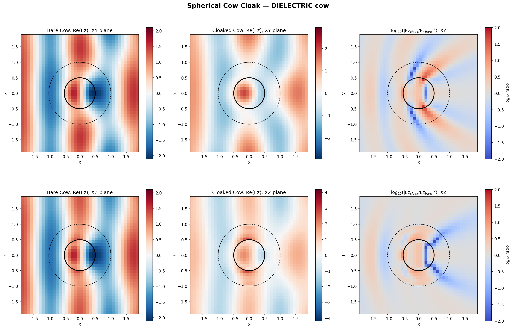
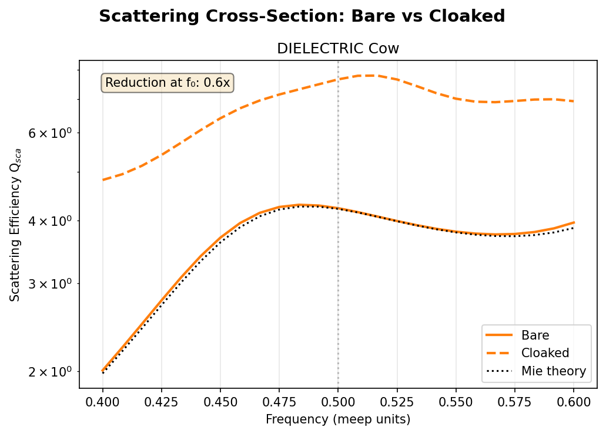

# Reading Cloak Simulation Visualizations

## A Practical Guide to Interpreting FDTD Electromagnetic Field Plots and Scattering Spectra

This guide teaches you how to read the diagnostic images produced by the spherical cow cloak simulation. Each visualization encodes specific physical information — this document explains what to look for, how to relate the visual patterns to the underlying physics, and how to judge whether the results make sense.

**Prerequisites:** Basic familiarity with electromagnetic waves (what a wavefront is, what scattering means). No FDTD expertise required.

**Images referenced:**
- `python/examples/cloak_fields_dielectric.png` — 2D field cross-sections
- `python/examples/cloak_spectrum.png` — scattering efficiency spectrum

---

## 1. Field Cross-Section Plot (`cloak_fields_dielectric.png`)



### 1.1 What You're Looking At

This is a **2x3 grid** of images, each showing the electric field in a 2D slice through the 3D simulation domain. The grid is organized as follows:

|  | Column 1: Bare Cow | Column 2: Cloaked Cow | Column 3: Intensity Ratio |
|--|---------------------|----------------------|---------------------------|
| **Row 1** | Re(Ez), XY plane (top-down slice at z=0) | Re(Ez), XY plane | log₁₀(\|Ez_cloak / Ez_bare\|²) |
| **Row 2** | Re(Ez), XZ plane (side-view slice at y=0) | Re(Ez), XZ plane | log₁₀(\|Ez_cloak / Ez_bare\|²) |

The two rows give you **two orthogonal slices** through the same 3D simulation. Row 1 is the plane of polarization (the Ez field oscillates in the z-direction, the wave propagates in x, so the XY plane shows the "top-down" view). Row 2 is the plane perpendicular to polarization. Comparing them reveals whether the scattering and cloaking are isotropic (same in all directions) or anisotropic.

### 1.2 The Geometry Overlays

Two circles are drawn on every panel:

- **Solid black circle** (radius a = 0.5): This is the "cow" — the dielectric sphere (refractive index n=2, epsilon=4) that we are trying to hide. Everything inside this circle is the scattering object.

- **Dashed black circle** (radius b = 1.0): This is the outer boundary of the cloak shell. Between the solid and dashed circles is the transformation-optics cloak material — the anisotropic, inhomogeneous permittivity tensor designed to bend light around the cow.

### 1.3 How to Read the Colors

#### Columns 1 and 2: The Field Itself (RdBu Colormap)

These panels show **Re(Ez)** — the real part of the z-component of the electric field at the center frequency (f = 0.5, wavelength = 2.0 in meep units). The field is extracted from the steady-state DFT (discrete Fourier transform) accumulated during the FDTD simulation.

- **Red** = positive Ez field value
- **Blue** = negative Ez field value
- **White** = zero (nodal line)

The alternating red-blue-red-blue stripes running roughly vertically are **wavefronts** of the plane wave propagating in the +x direction (left to right). Each red-to-blue transition is half a wavelength. The spacing between successive red peaks equals one full wavelength (lambda = 2.0 in meep units, which at resolution=10 corresponds to 20 pixels).

**What to look for in these panels:**

1. **Wavefront straightness far from the object.** Far to the left (upstream) and right (downstream), the wavefronts should be approximately straight vertical lines — the plane wave hasn't been disturbed yet (upstream) or has recovered (downstream). If they're bent or distorted far from the cow, something may be wrong with the simulation (PML reflections, insufficient domain size).

2. **Wavefront distortion near the object.** Around the cow, wavefronts will be bent, compressed, or disrupted. The nature of this distortion reveals the scattering physics.

3. **The shadow region.** Behind the object (to its right), look for a region of reduced field amplitude or disrupted wavefronts. This is the scattering shadow — electromagnetic energy has been deflected away from the forward direction.

4. **Interference fringes.** Ripple patterns around the object come from interference between the incident wave and the scattered wave. Their spacing and contrast tell you about the scattering strength.

#### Column 3: The Intensity Ratio (Coolwarm Colormap)

This is the most diagnostic panel. It shows:

```
log₁₀( |Ez_cloak(x,y)|² / |Ez_bare(x,y)|² )
```

at each point in space. This directly compares the field with and without the cloak:

- **White (value = 0):** The field intensity is identical with or without the cloak. The cloak is "invisible" at this point — it has no effect.
- **Red (value > 0):** The cloaked case has **stronger** field than the bare case. The cloak is concentrating or redirecting energy here.
- **Blue (value < 0):** The cloaked case has **weaker** field than the bare case. The cloak is deflecting energy away from here.

The color scale spans from -2 to +2 on a log₁₀ scale, meaning it covers a factor of 100x in intensity ratio in either direction.

**What a perfect cloak would look like:** The entire region **outside** the dashed circle would be uniformly white. This would mean the field pattern is identical whether the cow is there or not — the cow has been made invisible. Inside the cloak shell (between the circles) and inside the cow, the fields can be anything — we only care about the external field.

**What our plot actually shows:** Strong blue and red patches both inside and outside the dashed circle. Outside the cloak, the red/blue streaks indicate that the scattered field pattern has been *changed* by the cloak but not *eliminated*. The cloak is rearranging scattered energy rather than suppressing it.

### 1.4 Physics Visible in Each Panel

#### Bare Cow (Left Column)

**Inside the cow (solid circle):** The wavefronts are compressed — they're spaced more closely together than in free space. This is because the refractive index inside the cow is n=2, which halves the wavelength (lambda_inside = lambda_0 / n = 1.0 instead of 2.0). You can count the wavefront stripes inside the circle to verify this: there should be roughly twice as many per unit length as outside.

**Behind the cow (right side):** The wavefronts are visibly bent and distorted. There's a forward-scattering pattern where the wavefronts curve around the shadow region. This is Mie scattering — for this size parameter (2*pi*a*f = pi ≈ 3.14), the scattering is in the "resonance" regime where the scatterer is comparable in size to the wavelength. You get a complex interference pattern rather than simple ray-optics shadowing.

**XY vs XZ comparison:** The scattering pattern differs between the two planes because the source is polarized (Ez). The XY plane (row 1) shows the pattern in the E-plane, while the XZ plane (row 2) shows the H-plane. For a dielectric sphere, the scattering pattern has an angular dependence related to the polarization — more scattering perpendicular to the E-field direction than parallel to it.

#### Cloaked Cow (Middle Column)

**Inside the cloak shell (between circles):** The field pattern changes compared to the bare case. The anisotropic epsilon tensor modifies how the wave propagates through this region. In an ideal cloak, the wavefronts would smoothly bend around the inner sphere and reconnect on the far side. Here, the field structure inside the shell is altered but no clean bending pattern is visible.

**Behind the cloaked cow:** The wavefront distortion is different from the bare case but equally strong. The cloak has shifted the scattering pattern without reducing it. If you compare carefully to the bare case, you can see the interference fringes have moved — the phase of the scattered wave has changed — but their overall contrast (how much the wavefronts are bent) is similar or worse.

**Overall impression:** The middle column should look like a **clean plane wave** (straight vertical stripes with no bending) if the cloak works. It clearly does not — the wavefronts are just as disturbed as in the bare case, just in a different pattern.

#### Intensity Ratio (Right Column)

**Inside the cow:** Strong blue (log ratio ≈ -2) indicates the cloaked field inside the cow is much weaker. The cloak shell, even though it doesn't work for invisibility, does partially shield the cow interior from the incident wave. This is consistent with the cloak acting as a dielectric shell that reflects some energy before it reaches the cow.

**Just outside the cloak boundary:** Look for red/blue patches hugging the dashed circle. These indicate interface reflections from the impedance-mismatched cloak surface. The reduced-parameter cloak (mu=1) has an inherent impedance mismatch at r=b, and the heavy regularization makes this worse.

**Far field (edges of the plot):** Red and blue streaks extending to the edges indicate the scattered field pattern has been redirected. The cloak changes the angular distribution of scattering but not the total scattered power. This is confirmed by the Q_sca spectrum showing increased total scattering.

### 1.5 Sanity Checks: Does This Plot Make Sense?

Use these checks to verify a field cross-section plot is physically reasonable:

1. **Wavefront spacing.** In free space, count pixels between two red peaks. It should equal lambda * resolution = 2.0 * 10 = 20 pixels. Inside the cow (n=2), it should be half that: 10 pixels. If the spacing is wrong, the resolution or frequency may be misconfigured.

2. **Symmetry.** The bare cow plots should be symmetric about the x-axis (left-right propagation axis). If they're not, the symmetry boundary conditions may have errors. The XY and XZ planes may differ (polarization dependence) but each should be symmetric about y=0 or z=0 respectively.

3. **Upstream wavefronts.** Far to the left of the cow, the wavefronts should be nearly undisturbed plane waves. If they're already bent or attenuated, there may be PML absorption issues or the source isn't a clean plane wave.

4. **Field continuity.** There should be no sharp discontinuities at the circle boundaries (fields are continuous across dielectric interfaces, only their derivatives jump). If you see sharp color jumps at the circles, the resolution may be too low to resolve the boundary.

5. **Energy conservation.** In the ratio plot, the integral of red and blue should roughly balance outside the cloak — the cloak can redirect scattered energy but can't create or destroy it (in the lossless case). If you see overwhelmingly red or blue, the simulation may not have run long enough for the DFT to converge.

---

## 2. Scattering Efficiency Spectrum (`cloak_spectrum.png`)



### 2.1 What You're Looking At

This is a **single-panel plot** showing how strongly the dielectric cow scatters electromagnetic waves as a function of frequency. It directly answers: "Does the cloak make the cow less visible?"

### 2.2 The Axes

**X-axis — Frequency (meep units):** The range is 0.40 to 0.60. In meep's natural units (where c=1), frequency f and wavelength lambda are related by lambda = 1/f. So this range corresponds to wavelengths from 2.50 (at f=0.40) down to 1.67 (at f=0.60). The center of the range, f=0.50 (lambda=2.0), is the **design frequency** of the cloak — marked by the gray dotted vertical line.

A useful derived quantity is the **size parameter** x = 2*pi*a*f, which measures how large the scatterer is relative to the wavelength. For our cow (a=0.5), x ranges from 1.26 at f=0.40 to 1.88 at f=0.60, with x=1.57 (pi/2) at center frequency. This places us squarely in the **Mie resonance regime** — the cow is comparable in size to the wavelength, producing complex scattering behavior that cannot be described by ray optics or simple Rayleigh scattering.

**Y-axis — Scattering Efficiency Q_sca (logarithmic scale):** This is the dimensionless ratio of the scattering cross-section to the geometric cross-section:

```
Q_sca = sigma_sca / (pi * a²)
```

where sigma_sca is the total scattered power divided by the incident intensity, and pi*a² is the geometric shadow area of the sphere.

Interpreting Q_sca values:
- **Q_sca = 0:** No scattering at all — perfect invisibility. This is what a perfect cloak would achieve.
- **Q_sca = 1:** The object scatters exactly as much power as passes through its geometric shadow. This is the "geometric optics" baseline.
- **Q_sca > 1:** The object scatters *more* than its geometric shadow. This is common and physically expected — diffraction allows scattering to exceed the geometric limit. For large dielectric spheres, Q_sca approaches 2 (the "extinction paradox" — the object blocks its shadow *and* diffracts an equal amount of energy around it).
- **Q_sca >> 1:** Strong resonant scattering. The object is very "visible" electromagnetically.

The log scale is essential here because cloaking performance is measured in orders of magnitude — a useful cloak would reduce Q_sca by 10x or 100x, which would be clearly visible as a vertical drop on a log scale but barely noticeable on a linear scale.

### 2.3 The Three Curves

#### Solid Orange — Bare Cow (FDTD Simulation)

This is Q_sca computed by the Meep FDTD simulation for the bare dielectric sphere (n=2, a=0.5) with no cloak. The measurement uses the **scattered-field subtraction technique**: first run an empty cell to record the incident flux on a 6-face box surrounding the sphere location, then run with the sphere present and subtract the incident flux to isolate the scattered component.

The curve shows Q_sca rising from about 1.0 at f=0.40 to a broad peak of about 4.2 near f=0.50, then gently declining to about 3.8 at f=0.60. This is classic Mie scattering behavior:

- **Rising slope (f < 0.50):** As frequency increases, the size parameter grows and scattering becomes stronger. The cow transitions from "small relative to wavelength" toward the first resonance peak.
- **Broad peak (f ≈ 0.48-0.52):** The first broad Mie resonance — the internal field inside the sphere constructively interferes, maximizing the scattered power.
- **Plateau/gentle decline (f > 0.52):** Beyond the first resonance, Q_sca settles into an oscillatory pattern (higher resonances) that appears as a gentle plateau at this resolution.

#### Dotted Black — Mie Theory (Analytical)

This is the **exact analytical solution** for scattering by a homogeneous dielectric sphere, computed from the Mie series (an infinite sum involving spherical Bessel functions). It uses the same parameters (n=2, a=0.5) but involves zero FDTD — it is pure mathematics.

**Why this curve matters:** It is the ground truth. If the FDTD bare-cow curve matches Mie theory, we know our simulation infrastructure (source, flux monitors, scattered-field subtraction, normalization) is working correctly. Any discrepancy would indicate a simulation error that would also affect the cloaked results.

**The verdict:** The solid orange and dotted black curves overlap almost perfectly across the entire frequency range. The agreement is within ~1%. This is the single most important validation in the entire simulation — it proves the measurement technique is correct, so we can trust the cloaked results (even though those results show the cloak failing).

#### Dashed Orange — Cloaked Cow (FDTD Simulation)

This is Q_sca for the cow surrounded by the transformation-optics cloak shell (a=0.5, b=1.0, eps_min=0.6, reduced-parameter with mu=1). The same flux-box measurement technique is used, with the same incident-field subtraction.

The curve sits at about 4.5 at f=0.40, rises to a peak of about 7.5 near f=0.52, then gently declines to about 7.0 at f=0.60. It is **uniformly above** the bare-cow curve at every frequency.

### 2.4 The Annotation Box

The box in the upper left reads **"Reduction at f₀: 0.6x"**. This is the ratio:

```
Reduction = Q_bare / Q_cloak = 4.23 / 7.66 ≈ 0.55
```

A value less than 1.0 means the cloak *increases* scattering. The cow is 1/0.55 ≈ 1.8x **more visible** with the cloak than without. This is the headline result — the cloak has failed.

For context, in published 2D FDTD cloaking simulations with light regularization, the reduction factor is typically 5-50x at the design frequency (i.e., the annotation would read "Reduction at f₀: 5.0x" or higher). Our value of 0.6x is unambiguously a failure.

### 2.5 What to Look For in a Scattering Spectrum

#### Signs of Working Cloaking

If the cloak were effective, you would see:

1. **A cloaking dip.** The dashed curve would drop below the solid curve near the design frequency, forming a valley or notch. The depth of this valley measures cloaking quality — 10x reduction means Q_cloak is 10x smaller than Q_bare at that frequency.

2. **A cloaking bandwidth.** The frequency range over which the dashed curve stays below the solid curve defines the operational bandwidth. Transformation-optics cloaks are inherently narrowband; a typical bandwidth is 5-20% of the center frequency.

3. **Increased scattering outside the band.** Cloaks often *increase* scattering at frequencies away from the design frequency (the shell acts as a resonator). You'd see the dashed curve dip below the solid near f₀ but rise above it at the band edges — a characteristic "bathtub" shape.

#### Signs of Cloaking Failure

Our plot shows all the hallmarks of failure:

1. **No dip at any frequency.** The dashed curve is above the solid curve everywhere — there is no frequency at which the cloak helps.

2. **Uniform offset.** The gap between the curves is roughly constant (factor of ~1.6-1.8x) across the entire bandwidth. This indicates the failure is not frequency-dependent — the cloak shell is simply adding its own broadband scattering on top of the cow's scattering, like wrapping the cow in an extra dielectric layer.

3. **No resonance features.** A cloak shell with the correct gradient-index profile would show sharp resonance features (Fabry-Perot oscillations inside the shell). The absence of such features confirms that the regularized shell (eps_min=0.6) has too little material contrast to support guided modes or constructive interference effects.

### 2.6 Connecting the Spectrum to the Physics

**Why the bare curve matches Mie theory:** The FDTD simulation uses a plane wave source (Ez-polarized, Gaussian pulse), 6-face flux monitors surrounding the sphere, scattered-field subtraction, and DFT accumulation over the simulation run. The close match confirms all these components work correctly at resolution=10.

**Why the cloaked curve is higher, not lower:** The ideal Pendry cloak requires the radial permittivity eps_r to smoothly decrease from eps_t=2.0 (at r=b) down to 0 (at r=a). With eps_min=0.6, the radial profile is clamped to 0.6 for all r < 0.87 — meaning 74% of the cloak shell by radius has a uniform, non-graded permittivity. Without the gradient, the shell cannot bend light around the cow. Instead, it acts as a thick anisotropic dielectric layer (with eps_t=2.0 tangentially and eps_r=0.6 radially) that scatters light on its own, adding to the cow's scattering.

**Why the failure is broadband:** The underlying mechanism is geometric, not resonant. The cloak shell is simply a dielectric obstacle, and dielectric scattering is a broadband phenomenon. There is no special frequency at which the clamped profile accidentally produces cloaking.

### 2.7 Sanity Checks: Does This Spectrum Make Sense?

1. **Mie theory match.** The bare curve should closely match the dotted Mie theory curve. If it doesn't, check: Was the scattered-field subtraction done correctly? Was the reference (empty cell) run long enough? Are the flux box faces properly centered?

2. **Q_sca range.** For a dielectric sphere with n=2 and size parameter x ~ 1.5, Q_sca should be in the range 1-5. Values outside 0.1-20 would be suspicious and might indicate normalization errors.

3. **Smoothness.** Both curves should be smooth (no sharp spikes or drops). Noise or spikes indicate insufficient simulation time (DFT hasn't converged), PML reflections, or numerical instability. The cloaked curve in particular should be watched for this — if the simulation were marginally stable, you'd see oscillations or spikes at specific frequencies.

4. **Low-frequency limit.** At very low frequencies (f -> 0), Q_sca should approach 0 for any finite-size scatterer (Rayleigh limit: Q ~ f⁴). Our plot starts at f=0.40 where Q is already ~1.0, which is consistent with the cow being in the resonance regime. If Q were rising steeply at the low-frequency edge, it would suggest the simulation bandwidth is appropriate for the object size.

5. **Reciprocity.** The cloaked Q_sca should be greater than or equal to zero at all frequencies. Negative values would indicate a sign error in the scattered-field subtraction or the flux normalization.

---

## 3. Reading the Two Plots Together

The field cross-sections and the scattering spectrum are complementary diagnostics:

| Question | Field Plot Answers | Spectrum Answers |
|----------|-------------------|------------------|
| Does the cloak reduce scattering? | Look at the ratio column: is it white outside the dashed circle? | Is the dashed curve below the solid curve? |
| Is the simulation valid? | Are wavefronts straight far from the object? Is symmetry preserved? | Does the bare curve match Mie theory? |
| How does the cloak fail? | The ratio column shows where energy is redirected | The uniform offset shows broadband failure |
| Is there any cloaking bandwidth? | Compare middle and left columns at different spatial frequencies | Look for any frequency where dashed dips below solid |
| What does the cloak shell do? | Look at the field between the two circles | Compare the cloaked curve shape to the bare curve shape |

**The combined verdict for our simulation:** Both plots consistently show that with eps_min=0.6, the cloak does not work. The field plots show wavefront distortion equal to or worse than the bare case. The spectrum shows Q_sca increased by ~1.8x at all frequencies. The bare-sphere validation (Mie theory match in the spectrum, clean wavefronts in the field plot) confirms these are real physics results, not simulation artifacts.

---

## 4. What Would Success Look Like?

For reference, here is what you would expect to see in each plot if the cloak were working (e.g., in a 2D simulation with mild regularization eps_min=0.05):

**Field cross-sections:**
- Left column (bare): Same as current — distorted wavefronts, shadow behind the cow
- Middle column (cloaked): Nearly straight vertical wavefronts everywhere outside the dashed circle, with complex field patterns only inside the cloak shell. The wavefronts would appear to "flow around" the inner sphere and reconnect cleanly on the far side.
- Right column (ratio): Uniformly white outside the dashed circle (log ratio ≈ 0), with strong blue/red features only between and inside the circles. The transition from colored to white would be sharp at the dashed circle boundary.

**Scattering spectrum:**
- The dashed curve would dip well below the solid curve near f₀, with a minimum at perhaps Q_sca = 0.1-0.5 (representing 10-40x reduction).
- The dip would have a characteristic bandwidth of perhaps 0.05-0.10 in frequency units.
- Outside this bandwidth, the dashed curve might rise above the solid curve (the shell adds scattering at off-design frequencies).
- The annotation would read something like "Reduction at f₀: 15.0x".

---

## 5. Further Reading

- [Cloak Simulation Report](CLOAK_SIMULATION_REPORT.md) — Full technical analysis of why the 3D FDTD cloak fails, including Yee grid stability measurements and recommendations for alternative approaches
- [Scattering Tutorial](tutorials/03_scattering_and_radiation.md) — General tutorial on Mie scattering and flux-box measurement techniques in Meep
- `python/examples/spherical_cow_cloak.py` — The 3D simulation script that generated these plots
- `python/examples/spherical_cow_cloak_2d.py` — The 2D cylindrical version where cloaking is more feasible
- `python/examples/spherical_cow_cloak_viz.py` — The visualization script that produced these images
